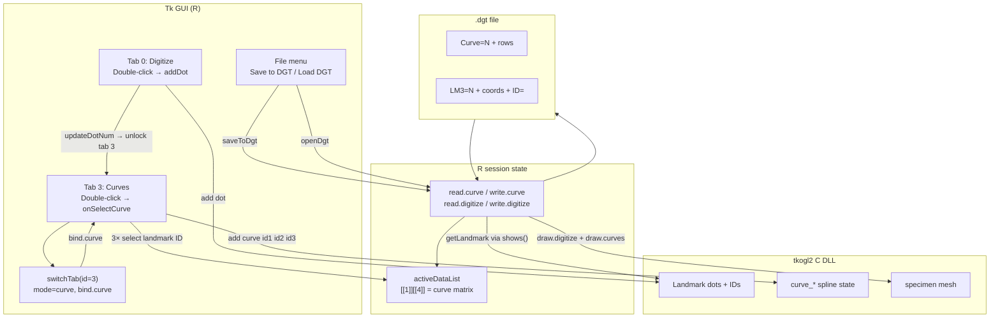

# Phase 4: Digitize Workflow - Research

**Researched:** 2026-06-15
**Domain:** Legacy R/Tcl/Tk digitize workflow — curve binding, `.dgt` persistence, GUI validation
**Confidence:** HIGH (code-verified in repo); MEDIUM (runtime behavior not yet smoke-tested for DGT-02–04)

## Summary

Phase 4 completes two remaining plans on top of validated landmark placement (04-01 / DGT-01): **curve definition** (04-02 / DGT-02) and **`.dgt` save/reload** (04-03 / DGT-03, DGT-04). All implementation already exists in the legacy R sources under `integrated-guimorph-development_EOC/Project/GUImorphDevelopment/R/` — this phase is **validation and targeted repair**, not greenfield design.

The curve workflow is tab-driven: place landmarks on the **3D Digitizing** tab (double-click `addDot`), unlock the **Curves** tab after the configured landmark count is reached, switch tab (`switchTab` id==3) to set `window mode = curve` and dispatch `bind.curve`, then **double-click three existing landmark dots** on the canvas to invoke `onSelectCurve`, which stores a row in `activeDataList[[1]][[4]]` and calls `add("curve", id1, id2, id3)` in the C engine. Save uses **File → Save to DGT** (`saveToDgt`); reload uses **File → Load DGT File** (`openDgt`).

Code review surfaced **three high-risk gaps** the planner must address: (1) `activeDataList[[*]][[4]]` is initialized as `list()` in `loadPly` but `onSelectCurve` uses `rbind()` expecting a matrix — first curve bind may error; (2) `drawElements()` has the curve-restore block wrapped in `if(0)`, so `openDgt` may not populate `activeDataList[[1]][[4]]` even when curves are read (display may rely on transient `e$dgtcurvestuff` only); (3) default `e$landmarkNum <- 5` blocks Curves tab until five landmarks are placed unless the user runs **Set number of landmarks** first — Phase 4 acceptance allows three landmarks, so validation must set count to 3 before placement.

**Primary recommendation:** Plan 04-02 as a scripted manual smoke test (set landmark count → place landmarks → Curve tab → triple double-click select → Fit once); plan 04-03 as multi-specimen save/reload with console verification of `Curve=` / `LM3=` sections and same-session GUI reopen; fix only digitize-path blockers (crashes, silent data loss), document UX quirks in `.planning/smoke-test-findings.md`.

<user_constraints>
## User Constraints (from CONTEXT.md)

### Locked Decisions

#### Curve Definition Workflow (DGT-02)
- **D-01:** Validate the **legacy curve workflow only** — Curve tab, `window mode = curve`, double-click to select 3 existing landmark dot IDs via `onSelectCurve`; do **not** enable dormant UI buttons (`Set curves (total) number`, `Set Current curve number`, `Compute Curves`) commented out in `ui.curve`.
- **D-02:** **Landmarks first, then curves** — user places landmarks on the Digitize tab (double-click `addDot`), switches to Curve tab, then selects 3 landmarks to form a curve. Curve bind does not create new landmarks.
- **D-03:** **One curve minimum** — 3 landmarks forming 1 curve row in `activeDataList[[1]][[4]]` satisfies DGT-02 acceptance.
- **D-04:** **Fit button smoke-test only** — click Fit once to confirm no crash; do not deep-validate semi-landmark spline/resampling math in Phase 4.

#### `.dgt` Save/Reload (DGT-03, DGT-04)
- **D-05:** **Primary save/reload verification: landmarks + curves** — Phase 4 success focuses on these sections; empty template/surface sections need not be explicitly tested if unused.
- **D-06:** **Reload via GUI menu** — validate `openDgt()` file-open path in `3dDigitize.main.r`; do not require separate validation of the C-side `loadDgt` Tcl command.
- **D-07:** **Anchors round-trip if present** — anchors are not a Phase 4 requirement to digitize, but if the user places anchors during the test session, saved `.dgt` must restore them on reload.
- **D-08:** **Multi-specimen validation required** — `saveToDgt` multi-specimen loop must be exercised, not single-specimen-only.
- **D-09:** **Same-session reload** — save `.dgt`, then reopen via GUI in the same GUImorph/R session; cold restart reload is out of scope for Phase 4.

#### Fix vs Document Boundary
- **D-10:** **26 `load_all` warnings — capture only** — run `warnings()` after `load_all`, log findings; fix only if a warning blocks curve/save/reload workflow.
- **D-11:** **Leave debug `print()` statements** — verbose logging in curve/save paths stays for Phase 4 debugging; cleanup deferred to Phase 9.
- **D-12:** **Blocker definition: digitize path failures only** — fix crashes, silent failures, or data loss in curve/save/reload; UX confusion (like single-click vs double-click) is documentation, not code fix.
- **D-13:** **Document quirks in `.planning/smoke-test-findings.md`** — append Phase 4 validation results and known workflow quirks there.

#### Validation Baseline
- **D-14:** **Primary test specimen: `C13.1.ply`** — continue Phase 3 smoke-test mesh from `zips/Folsom 3D models/`.
- **D-15:** **Create fresh `.dgt` during Phase 4** — no hunt for external legacy golden files; hand-digitize during validation.
- **D-16:** **Multi-specimen setup: two different PLY files** — load two meshes from the Folsom collection (including C13.1.ply plus a second specimen) to exercise multi-specimen save/reload.
- **D-17:** **Do not commit `.dgt` fixtures** — test artifacts stay local; embedded absolute/UNC specimen paths are machine-specific.

#### Carried Forward (prior phases — do not re-decide)
- Landmarks require **double-click** on canvas (`addDot`); single-click is pick/select only (`set dot selected`).
- **Option A** locked — rehabilitate legacy C/R engine; no rgl/Shiny rewrite.
- WSL UNC paths work for package load and PLY access; MinGW DLL in `inst/libs/x64/`.

### Claude's Discretion
None — user made explicit choices for all gray areas.

### Deferred Ideas (OUT OF SCOPE)
- **Enable dormant curve UI** (`Set curves number`, `Compute Curves`) — user chose legacy-only workflow; belongs in future enhancement, not Phase 4.
- **Deep Fit / spline math validation** — deferred; Phase 4 smoke-test only.
- **Cold restart `.dgt` reload** (quit R, relaunch, open file) — deferred; same-session sufficient.
- **Committed `.dgt` golden fixture** — deferred; paths are machine-specific.
- **Fix all 26 `load_all` warnings** — deferred unless blocking digitize; capture only.
- **Debug print cleanup** — Phase 9 C engine cleanup scope.
- **C-side `loadDgt` standalone validation** — deferred; GUI `openDgt()` is the Phase 4 path.
</user_constraints>

<phase_requirements>
## Phase Requirements

| ID | Description | Research Support |
|----|-------------|------------------|
| DGT-01 | User can place landmarks on the loaded specimen | ✅ Validated 2026-06-15 — double-click `addDot` in `3dDigitize.digitize.r:314-316`; baseline for curve landmark IDs |
| DGT-02 | User can define curves (semi-landmark splines) on the specimen | Legacy path: `bind.curve` → `onSelectCurve` → `add("curve",…)`; tab unlock via `updateDotNum`; Fit smoke via shared `onFit` |
| DGT-03 | User can save digitized data to a `.dgt` file | `saveToDgt` menu hook + `write.curve` / `write.digitize` / `write.anchors` / `write.surface`; multi-specimen loop at lines 1658-1703 |
| DGT-04 | Saved `.dgt` file reloads with landmarks/curves intact | `openDgt` → `read.*` parsers → `drawElements`; curve display via `e$dgtcurvestuff` + `switchTab` id==3; verify/fix `drawElements` curve slot assignment |
</phase_requirements>

## Architectural Responsibility Map

| Capability | Primary Tier | Secondary Tier | Rationale |
|------------|-------------|----------------|-----------|
| Landmark placement | Browser / Client (Tk canvas + C renderer) | R orchestration (`addDot`, `convertCoor`) | Mouse events bound in R; coordinates resolved via C `shows("specimen","xyz")` |
| Curve definition (3 landmark IDs) | Browser / Client | R state (`activeDataList[[1]][[4]]`) | Selection uses C `set("dot","selected")` + `shows("landmark","id")`; curve row stored in R, sent to C via `add("curve",…)` |
| Curve spline / semi-landmark math | C engine (`curve_*` in `tkogl2/src/`) | — | Phase 4 defers math validation (D-04); R only passes landmark indices |
| `.dgt` file format / parse | R I/O layer | — | All section readers/writers are pure R on scanned line vectors |
| Session persistence (save) | R I/O + C coordinate query | C memory | `getLandmark`/`getAnchor` pull live coords from C via `shows()` before write |
| Session restore (open) | R I/O + C load commands | C memory | `draw.digitize`/`draw.anchors`/`draw.curves` push into C; GUI state in `dgtDataList` |
| Tab/mode switching | R GUI controller (`switchTab`) | C `set("window","mode",…)` | Determines which `bind.*` method is active via S3 `class(e)` |

## Standard Stack

### Core

| Library | Version | Purpose | Why Standard |
|---------|---------|---------|--------------|
| R + tcltk | 4.6+ / base | GUI event loop, file dialogs | Package `Imports: tcltk`; entire digitize UI is Tcl/Tk [VERIFIED: `DESCRIPTION`] |
| tcltk2 | CRAN (pinned in renv TBD) | Extended Tk widgets (`ttk*`) | Used throughout `ui.*` builders [VERIFIED: `DESCRIPTION`] |
| tkogl2 (MinGW DLL) | 2020 protocol, MinGW build 2026-06-15 | OpenGL rendering, dot/curve/anchor C state | `inst/libs/x64/tkogl2.dll`; `add`/`set`/`shows` in `rtkogl.R` [VERIFIED: codebase + Phase 1–3 smoke] |
| devtools | [ASSUMED] latest | `load_all(".")` from package root | Validated Phase 2 smoke [VERIFIED: `.planning/smoke-test-findings.md`] |

### Supporting

| Library | Version | Purpose | When to Use |
|---------|---------|---------|-------------|
| geomorph / Morpho / Rvcg / vegan | 4.x (migrate Phase 5) | Analysis tabs | Not invoked in Phase 4 plans 04-02/04-03 |
| glut64.dll | bundled | GLUT runtime | Co-located in `inst/libs/x64/` [VERIFIED: Phase 1–2] |

### Alternatives Considered

| Instead of | Could Use | Tradeoff |
|------------|-----------|----------|
| Legacy `onSelectCurve` workflow | Dormant `setCurvesNum` / `onComputeCurves` UI | User locked legacy-only (D-01); dormant buttons intentionally commented out in `ui.curve` |
| C `loadDgt` Tcl command | R `openDgt()` GUI path | User locked GUI path (D-06) |
| Automated test harness | Manual GUI smoke + console log review | No existing testinfra; Nyquist maps to manual UAT checklist |

**Installation:** No new packages for Phase 4. Working directory for validation:

```r
setwd("integrated-guimorph-development_EOC/Project/GUImorphDevelopment")
devtools::load_all(".")
warnings()  # capture 26 warnings — D-10
GUImorph()
```

**Version verification:** Package version `1.0.0.08.18.2020.16.28` in `DESCRIPTION`; runtime DLL is MinGW rebuild deployed 2026-06-15.

## Package Legitimacy Audit

> Phase 4 installs **no new external packages**. Rehabilitation uses existing R/C stack only.

| Package | Registry | Verdict | Disposition |
|---------|----------|---------|-------------|
| *(none new)* | — | — | No installs planned |

**Packages removed due to [SLOP] verdict:** none
**Packages flagged as suspicious [SUS]:** none

## Architecture Patterns

### System Architecture Diagram



### Recommended Project Structure

```
integrated-guimorph-development_EOC/Project/GUImorphDevelopment/
├── R/
│   ├── 3dDigitize.main.r      # switchTab, saveToDgt, openDgt, drawElements, loadPly
│   ├── 3dDigitize.curve.r     # bind.curve, onSelectCurve, read/write.curve, draw.curves
│   ├── 3dDigitize.digitize.r  # bind.digitize, addDot, read/write.digitize, tab unlock
│   ├── 3dDigitize.surface.r   # read/write.surface (openDgt dependency)
│   └── rtkogl.R               # add/set/shows Tcl bridge
├── inst/libs/x64/tkogl2.dll   # MinGW deployed DLL
└── DESCRIPTION
```

Parallel copy under `Project/tkogl2/R/` exists but **canonical package root** for `load_all` is `GUImorphDevelopment/` [VERIFIED: `.planning/PROJECT.md`, smoke-test cwd].

### Pattern 1: Tab-driven mode dispatch (S3 on environment `e`)

**What:** `switchTab(e, id)` sets `e$tab`, `set("window","mode", …)`, `class(e) <- "digitize"|"curve"|…`, then `bind(e)` dispatches to `bind.digitize`, `bind.curve`, etc.

**When to use:** Any canvas interaction change between tabs.

**Key locations:**
- Curve tab entry: `3dDigitize.main.r:281-411` — sets `mode=curve`, restores curves from `e$dgtcurvestuff` or `activeDataList[[1]][[4]]`, calls `class(e) <- "curve"` and `bind(e)`.
- File menu wiring: `3dDigitize.main.r:548-561`.

### Pattern 2: Three-click curve bind (legacy)

**What:** On Curve tab, each double-click selects an **existing** landmark; on the 3rd selection, append matrix row and notify C.

**When to use:** DGT-02 acceptance (D-01–D-03).

**Flow (`3dDigitize.curve.r`):**
1. `bind.curve` lines 91-104 — `<Double-Button-1>` → `onSelectCurve(e,x,y)`
2. `onSelectCurve` lines 212-298 — `set("dot","selected")` → `shows("landmark","id")` → accumulate `e$curveLine`
3. On 3rd dot (lines 260-289): `rbind` into `e$activeDataList[[1]][[4]]`, `add("curve", id1, id2, id3)`
4. Middle dot (2nd selection) added to `e$sliders` (line 257) for spline slider coloring

### Pattern 3: `.dgt` sectioned text format

**What:** Line-oriented sections appended to a single file. Curve section written **first** in save order.

**Section order in `saveToDgt` (`3dDigitize.main.r:1648-1703):**
1. `write.curve` → `Curve=N` header + N×3 integer matrix (landmark IDs, not XYZ)
2. `write.template` → `TemplateNumber=…`
3. Per specimen loop: `write.digitize` (`LM3=`), `write.anchors` (`AC3=`, `ID=`), `write.surface` (`Template=`, `Surface=`)

**Read order in `openDgt` (`3dDigitize.main.r:2506-2719):** digitize → template → anchors → surface → curves → `drawElements`.

### Anti-Patterns to Avoid

- **Single-click on Curve tab expecting new landmarks:** Same UX trap as DGT-01 — selection is double-click only (D-12: document, don’t “fix”).
- **Enabling dormant curve buttons:** Violates D-01; `ui.curve` lines 81-84 keep them commented out of `tkpack`.
- **Bypassing GUI for `loadDgt` C command:** Out of scope (D-06).
- **Refactoring C curve math before GUI path works:** `.planning/research/PITFALLS.md` pitfall #1.

## Don't Hand-Roll

| Problem | Don't Build | Use Instead | Why |
|---------|-------------|-------------|-----|
| Curve landmark ID selection | Custom pick buffer / new dot type | `onSelectCurve` + `set("dot","selected")` + `shows("landmark","id")` | C already assigns stable landmark IDs; curve rows are ID triplets |
| `.dgt` parser | New serialization format | `read.curve`, `read.digitize`, existing section grep/sub parsers | Downstream geomorph/GPA code expects legacy sections |
| Coordinate export at save | Re-read from R matrices only | `getLandmark(id)` / `getAnchor(id)` via `shows("landmark/anchor","xyz", id)` | Saves reflect live C state including drag adjustments |
| Curve C display | R-side OpenGL | `add("curve",…)`, `draw.curves`, `switchTab` restore block | Spline geometry lives in `curve_ZARF_9.c` / `tcl_if_ZARF_9.c` |
| Multi-specimen memory | Re-load PLY per save | Existing `set("specimen","allocate", n)` + `saveToDgt` loop | Already implemented; Phase 4 only validates |

**Key insight:** Phase 4 success is wiring verification across R↔C↔disk boundaries that already exist — not new abstractions.

## Common Pitfalls

### Pitfall 1: Curves tab stays disabled

**What goes wrong:** User places 3 landmarks but Curves tab never enables.

**Why it happens:** `updateDotNum` unlocks tabs 2–4 only when `nDots == e$landmarkNum` (`3dDigitize.digitize.r:1009-1021`). Default `e$landmarkNum <- 5` (`init.digitize` line 35).

**How to avoid:** Before placement, use **Set number of landmarks** → `3` (or place five landmarks). Document in smoke-test-findings (D-13).

**Warning signs:** `Number of Landmarks: 3` but Curve tab greyed out.

### Pitfall 2: `rbind` failure on first curve (empty `list()` slot)

**What goes wrong:** Third double-click on Curve tab throws error; no curve row persisted.

**Why it happens:** `loadPly` initializes `activeDataList[[i]][[4]] <- list()` (`3dDigitize.main.r:1266`), but `onSelectCurve` does `rbind(curves, newCurve)` expecting a matrix (`3dDigitize.curve.r:271-274`).

**How to avoid:** Initialize slot 4 as `matrix(nrow=0, ncol=3)` OR guard first row assignment — **fix if confirmed at runtime** (D-12 blocker).

**Warning signs:** R error `numbers of columns of arguments do not match` on 3rd curve click.

### Pitfall 3: Reload loses curves from `activeDataList` (save round-trip)

**What goes wrong:** After `openDgt`, curves visible once but **Save to DGT** writes `Curve=0`; or Curve tab shows data only until tab switch.

**Why it happens:** `drawElements` curve restore is inside `if(0)` block (`3dDigitize.main.r:1558-1586`) — `dgtDataList[[1]][[4]] <- curves` never runs. `openDgt` sets transient `e$dgtcurvestuff` (lines 2673-2691) used by `switchTab` (lines 303-308) but not merged into `activeDataList[[1]][[4]]`.

**How to avoid:** Re-enable curve assignment in `drawElements` (minimal fix) or copy `e$dgtcurvestuff` into `activeDataList[[1]][[4]]` after read — **fix if DGT-04 fails** (D-12).

**Warning signs:** Console shows parsed `curves` matrix on open, but `saveToDgt` prints empty curve data.

### Pitfall 4: `openDgt` abort on NULL surface

**What goes wrong:** Load DGT returns early with `NULL surface data : returning FALSE`.

**Why it happens:** `read.surface` returns `NULL` when no `Surface=` lines (`3dDigitize.surface.r:577-580`); `openDgt` treats NULL as fatal (`3dDigitize.main.r:2580-2583`). Fresh saves should write `Surface=0` via `write.surface` when no downsample data.

**How to avoid:** Verify saved file contains `Surface=0`; if hand-edited files lack surface section, fix read path only if it blocks DGT-04 (D-05 allows skipping unused sections).

### Pitfall 5: Multi-specimen navigation traps

**What goes wrong:** Cannot advance to specimen 2, or tabs disable unexpectedly.

**Why it happens:** `onNext` requires full landmark count on Digitize tab (`3dDigitize.main.r:869-927`) and resets tab states (lines 981-1010).

**How to avoid:** Complete landmarks on specimen 1 on **Digitize tab**, click Next, repeat for specimen 2 before save.

### Pitfall 6: Double-click vs single-click on Curve tab

**What goes wrong:** User single-clicks landmarks on Curve tab; nothing binds.

**Why it happens:** `bind.curve` only wires double-click (`3dDigitize.curve.r:101-103`); single-click is not bound for curve selection.

**How to avoid:** Document parallel to DGT-01 UX correction (D-13).

### Pitfall 7: Specimen path resolution on reload

**What goes wrong:** `drawElements` skips specimens whose PLY paths don’t exist (`3dDigitize.main.r:1421-1438`).

**Why it happens:** Save stores `basename()` only (`saveToDgt` line 1665); reload prepends `e$dgtPath` when ID lacks path (`read.digitize` lines 1111-1133). PLY must be discoverable relative to `.dgt` directory or absolute path.

**How to avoid:** Save `.dgt` to a directory where specimen PLY paths resolve (same folder as meshes, or keep original load paths valid). D-17 — don’t commit fixtures.

## Code Examples

### Curve bind: `bind.curve` + `onSelectCurve`

```r
# Source: integrated-guimorph-development_EOC/Project/GUImorphDevelopment/R/3dDigitize.curve.r

# bind.curve (lines 91-104)
bind.curve <- function(e) {
  tkbind(e$canvasFrame, "<Double-Button-1>", function(x, y) {
    onSelectCurve(e, x, y)
  })
}

# onSelectCurve — 3rd selection commits curve (lines 260-289)
else if (e$curveDotNum == 3) {
  set("window", "mode", "digitize")
  changeDotColor(e)
  set("window", "mode", "curve")
  curves <- e$activeDataList[[1]][[4]]
  newCurve <- matrix(e$curveLine, nrow = 1, ncol = 3)
  curves <- rbind(curves, newCurve)
  e$activeDataList[[1]][[4]] <- curves
  add("curve", e$curveLine[1], e$curveLine[2], e$curveLine[3])
  e$curveDots <- c(); e$curveDotNum <- 0; e$curveLine <- c()
}
```

### `.dgt` curve I/O: `write.curve` / `read.curve`

```r
# Source: 3dDigitize.curve.r

# write.curve (lines 136-158) — Curve=N then rows of three landmark IDs
write.curve <- function(fileName, curves) {
  if (length(curves) > 0) {
    write(paste("Curve=", nrow(curves), sep = ""), fileName, append = TRUE)
    write.table(curves, fileName, sep = " ", col.names = FALSE, row.names = FALSE, append = TRUE)
    write("", fileName, append = TRUE)
  } else {
    write(paste("Curve=0", sep = ""), fileName, append = TRUE)
  }
}

# read.curve (lines 110-132)
read.curve <- function(content) {
  startLine <- grep("Curve=", content, ignore.case = TRUE)
  num <- sub("Curve=", "", content[startLine], ignore.case = TRUE)
  if (num == 0) return(NULL)
  endLine <- as.numeric(startLine) + as.numeric(num)
  tmp <- content[(startLine + 1):endLine]
  matrix(as.numeric(unlist(strsplit(tmp, " "))), ncol = 3, byrow = TRUE)
}
```

### Save path: `saveToDgt`

```r
# Source: 3dDigitize.main.r (lines 1618-1703 excerpt)

saveToDgt <- function(e) {
  fileName <- tclvalue(tkgetSaveFile(filetypes = "{DGT {.dgt}}"))
  file.create(fileName)
  curves <- e$activeDataList[[1]][[4]]
  write.curve(fileName, curves)
  write.template(fileName, e$templOrig)
  for (i in seq_len(length(e$activeDataList))) {
    specimenId <- basename(e$activeDataList[[i]][[1]])
    landmarks <- getLandmark(i)
    anchors <- getAnchor(i)
    write.digitize(fileName, specimenId, landmarks)
    write.anchors(fileName, specimenId, anchors)
    write.surface(fileName, e$activeDataList[[i]][[5]], e$activeDataList[[i]][[8]])
    write("", fileName, append = TRUE)
  }
}
```

### Reload path: `openDgt` + curve handoff

```r
# Source: 3dDigitize.main.r (lines 2458-2719 excerpt)

openDgt <- function(e) {
  init.main(e)   # resets session state — same-session reload (D-09)
  dgtfileName <- tclvalue(tkgetOpenFile(filetypes = "{DGT {.dgt}}"))
  e$dgtPath <- dirname(dgtfileName)
  rawContent <- scan(file = dgtfileName, what = "char", sep = "\n", quiet = TRUE)
  olddat <- read.digitize(e, content = rawContent)
  anchors <- read.anchors(rawContent)
  surfaceData <- read.surface(rawContent)
  curves <- read.curve(rawContent)
  e$dgtcurvestuff <- curves   # used by switchTab id==3 (lines 303-308)
  drawElements(e, olddat, surfaceData, curves, anchors)
}
```

### Tab switch curve restore (`switchTab` id==3)

```r
# Source: 3dDigitize.main.r (lines 281-289, 331-373 excerpt)

else if (id == 3 && e$tabState[3] == 1) {
  e$tab <- 3
  set("window", "mode", "curve")
  if (!is.null(e$dgtcurvestuff)) draw.curves(e$dgtcurvestuff)
  curves <- e$activeDataList[[1]][[4]]
  if (length(curves) > 0) {
    add("initialize", 2, 0, 0)
    add("InfoCurves", nrow(curves), 3, length(e$activeDataList))
    for (j in 1:nrow(curves)) {
      add("curve", as.integer(curves[j,1]), as.integer(curves[j,2]), as.integer(curves[j,3]))
    }
    add("InfoCurves_complete", 0, 0, 0)
  }
  class(e) <- "curve"
  bind(e)
}
```

### Fit smoke (shared handler)

```r
# Source: 3dDigitize.main.r (lines 1095-1126)
# Invoked from ui.curve Fit button (3dDigitize.curve.r:51-57)
onFit <- function(e) {
  if (length(e$activeDataList) == 0) return()
  # Resets specimen rotation/zoom — no curve-specific math
  set("specimen", "angle", "x", -angelX)
  set("specimen", "angle", "y", -angelY)
  # ... scale reset loops ...
}
```

## State of the Art

| Old Approach | Current Approach | When Changed | Impact |
|--------------|------------------|--------------|--------|
| Visual Studio + legacy DLL | MinGW CMake DLL in `inst/libs/x64/` | 2026-06-15 | Phase 4 validates against MinGW build, not 2020 VS DLL |
| Assumed single-click landmark place | Documented double-click `addDot` | 2026-06-15 | Curve tab uses same double-click gesture for selection |
| Dormant multi-curve UI | Legacy 3-click `onSelectCurve` only | 2020-07-14 comments in `ui.curve` | Phase 4 must not enable commented buttons |

**Deprecated/outdated:**
- `setCurvesNum` / `onComputeCurves` — marked "under construction" (`3dDigitize.curve.r:469-472`); out of scope (D-01).

## Assumptions Log

| # | Claim | Section | Risk if Wrong |
|---|-------|---------|---------------|
| A1 | `load_all(".")` cwd is `GUImorphDevelopment/` | Standard Stack | Wrong source tree edited if cwd differs |
| A2 | Folsom PLYs live at `zips/Folsom 3D models/C13.1.ply` | Environment | Path missing on disk blocks GUI-02 baseline (not seen in workspace glob — may be gitignored) |
| A3 | `rbind(list(), matrix)` fails on first curve in current R | Pitfall 2 | If R coerces `list()` silently, pitfall may not apply — runtime check required |
| A4 | Fresh `saveToDgt` always emits parseable `Surface=0` | Pitfall 4 | If absent, `openDgt` may fail DGT-04 |

## Open Questions (RESOLVED)

1. **Does first curve bind succeed without code fix?** — **RESOLVED**
   - Answer: No — `list()` slot breaks `rbind()` on first curve bind.
   - Plan decision: 04-02 Task 1 proactively initializes `activeDataList[[1]][[4]]` as `matrix(nrow=0, ncol=3)` in `loadPly` per D-12.

2. **Is `drawElements` `if(0)` curve block intentional?** — **RESOLVED**
   - Answer: Disabled block causes reload data loss — not acceptable for DGT-04.
   - Plan decision: 04-03 Task 1 re-enables curve restore with null-safe guard; assigns `dgtDataList[[1]][[4]] <- curves` per D-12.

3. **Which second Folsom PLY for D-16?** — **RESOLVED**
   - Answer: Any second distinct file from Folsom collection.
   - Plan decision: 04-03 Task 2 uses `A6.1.ply` or `B7.1.ply` alongside `C13.1.ply` (referenced in dev test sequences `3dDigitize.main.r:1907+`).

## Environment Availability

| Dependency | Required By | Available | Version | Fallback |
|------------|------------|-----------|---------|----------|
| Windows R | All GUI validation | ✓ (validated Phase 1–3) | 4.6+ | Required — WSL R insufficient for GUI |
| WSL UNC paths | `load_all`, PLY load | ✓ (validated) | — | Copy repo to `C:\dev\GUImorph` per PITFALLS #5 |
| MinGW `tkogl2.dll` | Rendering/digitize | ✓ | deployed 2026-06-15 | Re-deploy from `build/tkogl2.dll` |
| `glut64.dll` | OpenGL | ✓ | bundled `inst/libs/x64/` | Co-locate beside DLL |
| Folsom PLY specimens | D-14, D-16 | ⚠ unverified in workspace scan | `C13.1.ply` + second | User-confirmed path from Phase 3 smoke |
| `template.txt` | `write.template` rich path | ✗ optional | — | Saves `TemplateNumber=NULL` — acceptable (D-05) |

**Missing dependencies with no fallback:**
- Windows R desktop session with working OpenGL (not RDP-black-screen)

**Missing dependencies with fallback:**
- UNC slowness → local Windows copy

## Validation Architecture

> Nyquist enabled (`workflow.nyquist_validation: true`). No automated GUI test framework exists — Phase 4 validation is **manual UAT with console evidence**.

### Test Framework

| Property | Value |
|----------|-------|
| Framework | Manual smoke UAT + R console inspection (no testthat/pytest) |
| Config file | none |
| Quick run command | `devtools::load_all(".")`; `warnings()` |
| Full suite command | Phase 4 UAT checklist below (04-02 + 04-03 + D-10) |

### Phase Requirements → Test Map

| Req ID | Behavior | Test Type | Automated Command | File Exists? |
|--------|----------|-----------|-------------------|-------------|
| DGT-02 | Define 1 curve via 3 landmark double-clicks on Curve tab | manual UAT | — (GUI) | ❌ Wave 0 — document in smoke-test-findings |
| DGT-02 | Fit button no crash | manual UAT | Click Fit on Curve tab once | ❌ |
| DGT-03 | Save `.dgt` with landmarks+curves, 2 specimens | manual UAT | File → Save to DGT after multi-specimen digitize | ❌ |
| DGT-03 | File contains `Curve=1` and `LM3=` sections | manual | `grep "^Curve=" saved.dgt`; inspect console `Writing curve data` | ❌ |
| DGT-04 | Same-session reload restores landmarks | manual UAT | File → Load DGT File | ❌ |
| DGT-04 | Reload restores curve (visual + `e$dgtcurvestuff` / tab switch) | manual UAT | Switch to Curves tab after open | ❌ |
| DGT-04 | Re-save after reload preserves curves | manual UAT | Save again; verify `Curve=` still non-zero | ❌ |
| D-10 | Capture 26 load_all warnings | manual | `warnings()` after `load_all` | ❌ |

### Sampling Rate

- **Per task commit:** `load_all(".")` must succeed (no fatal error)
- **Per wave merge:** Complete 04-02 or 04-03 UAT checklist once on Windows R
- **Phase gate:** DGT-02–04 checked TRUE in `REQUIREMENTS.md`; findings appended to `smoke-test-findings.md`

### Wave 0 Gaps

- [ ] `.planning/smoke-test-findings.md` — Phase 4 section template (append-only per D-13)
- [ ] UAT script/checklist file optional — planner may embed steps in PLAN.md
- [ ] No CI/automated GUI driver — accept manual-only with Nyquist justification
- [ ] Confirm/fix `activeDataList[[1]][[4]]` init and `drawElements` curve assignment before declaring DGT-04

### Recommended UAT sequence (planner task input)

**04-02 — Curve definition**
1. `load_all` → capture `warnings()` (D-10)
2. `GUImorph()` → Load PLY `C13.1.ply`
3. Digitize tab → **Set number of landmarks = 3** (unlock curve tab with minimum landmarks)
4. Double-click 3 landmarks on mesh
5. Open **Curves** tab (verify `switchTab` sets mode=curve; console: `switched to CURVE Tab`)
6. Double-click each landmark (3 selections) — expect `add curve` console lines
7. Click **Fit** once — no crash (D-04)
8. Optional: verify `activeDataList[[1]][[4]]` row in R console

**04-03 — Save/reload**
1. Load **two** distinct Folsom PLYs (multi-select in load dialog)
2. Place ≥3 landmarks per specimen (adjust landmark count if needed); define ≥1 curve on specimen 1
3. File → **Save to DGT** → local path (not committed — D-17)
4. Inspect file: `Curve=1`, three integer IDs; per-specimen `LM3=` and `ID=` basename lines
5. File → **Load DGT File** (same session — D-09)
6. Verify landmarks visible; switch to Curves tab — curve display restored
7. Save again — confirm curves still serialized (guards Pitfall 3)
8. Append results to `.planning/smoke-test-findings.md` (D-13)

## Security Domain

### Applicable ASVS Categories

| ASVS Category | Applies | Standard Control |
|---------------|---------|------------------|
| V2 Authentication | no | Desktop single-user GUI |
| V3 Session Management | no | — |
| V4 Access Control | no | — |
| V5 Input Validation | yes | Validate numeric parses in `read.curve` / `read.digitize`; reject malformed row counts; `file.exists` guards in `drawElements` |
| V6 Cryptography | no | Plaintext `.dgt` by design |

### Known Threat Patterns for R/Tcl desktop digitizer

| Pattern | STRIDE | Standard Mitigation |
|---------|--------|---------------------|
| Malicious `.dgt` path injection | Tampering | `read.digitize` path join only when ID lacks `/`; use trusted local files in validation |
| Oversized `.dgt` line scan | DoS | `scan()` loads full file — acceptable for research-scale files; note for future hardening |
| UNC path trickery | Spoofing | Use known specimen directories during validation (D-14–D-16) |

## Project Constraints (from .cursorrules)

- Prefer `rtk`-prefixed shell commands when executing git/file operations in agent sessions (token optimization).
- No additional coding constraints affecting Phase 4 digitize logic.

## Sources

### Primary (HIGH confidence)
- `integrated-guimorph-development_EOC/Project/GUImorphDevelopment/R/3dDigitize.curve.r` — curve bind, I/O, UI
- `integrated-guimorph-development_EOC/Project/GUImorphDevelopment/R/3dDigitize.main.r` — saveToDgt, openDgt, switchTab, drawElements
- `integrated-guimorph-development_EOC/Project/GUImorphDevelopment/R/3dDigitize.digitize.r` — addDot, tab unlock, read/write digitize
- `.planning/phases/04-digitize-workflow/04-CONTEXT.md` — locked decisions

### Secondary (MEDIUM confidence)
- `.planning/smoke-test-findings.md` — Phase 1–3 baseline, DGT-01 UX
- `.planning/research/PITFALLS.md` — refactor-before-GUI, path pitfalls
- `.planning/research/FEATURES.md` — curves + `.dgt` as table stakes

### Tertiary (LOW confidence — needs runtime confirmation)
- Assumptions A2–A4 in Assumptions Log

## Metadata

**Confidence breakdown:**
- Standard stack: HIGH — frozen legacy stack validated Phases 1–3
- Architecture: HIGH — full call graph traced in canonical R sources
- Pitfalls: MEDIUM — init/reload issues inferred from static analysis; need 04-02/04-03 smoke

**Research date:** 2026-06-15
**Valid until:** 2026-07-15 (stable legacy code; 7 days if MinGW DLL changes)
