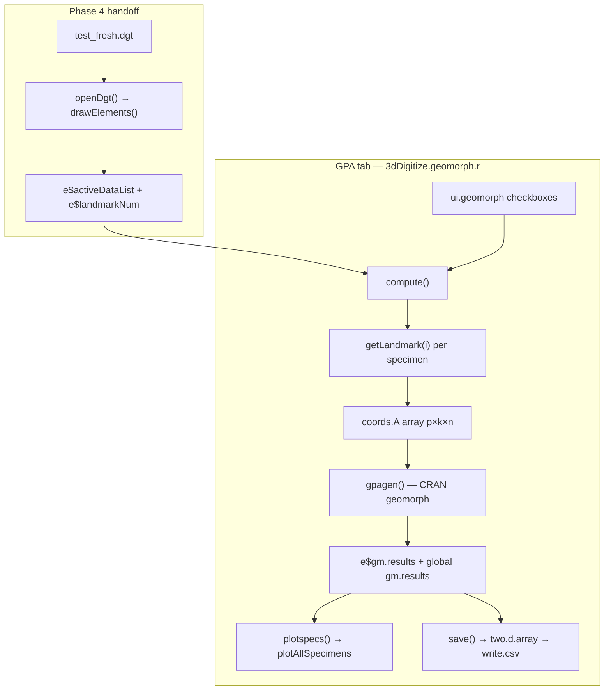

# Phase 5: Analysis Round-Trip - Research

**Researched:** 2026-06-16
**Domain:** geomorph 4.x GPA integration in legacy Tcl/Tk R GUI
**Confidence:** HIGH (hot-path API); MEDIUM (3D plot runtime deps on Windows)

## Summary

Phase 5 restores the **existing GPA tab** in `3dDigitize.geomorph.r` against current CRAN geomorph (4.1.0 per STACK.md). The hot path is narrow: `compute()` → `gpagen()` → `plotspecs()` / `save()`. CRAN `gpagen` is used via `@import geomorph`; the vendored `geomorph.support.code.r` (~2800 lines) is **not** on the landmarks-only GPA path and should remain untouched per D-10.

Code review found **two confirmed API mismatches** in the hot path that will block ANAL-01 UAT even if `gpagen` succeeds: `save()` references `e$gm.results$coord` (geomorph returns `$coords`), and `plotspecs()` passes `plot.param=` (geomorph 4.x expects `plot_param=`). The `gpagen()` call signature in `compute()` is largely compatible with geomorph 4.x; landmarks-only input as a `(p × k × n)` array — e.g. `(3 × 3 × 2)` from `test_fresh.dgt` — is explicitly supported when `curves` and `surfaces` are `NULL`.

ProcD default changed to `FALSE` in geomorph 4.0; GUImorph passes `ProcD` explicitly from the checkbox (default ON), so behavior matches legacy UI intent. `max.iter` is passed via `tclvalue()` as a **character** string; coerce to numeric if GPA misbehaves.

**Primary recommendation:** UAT-first on Windows R with `test_fresh.dgt` to surface runtime errors, then apply minimal hot-path fixes (`$coords`, `plot_param`, optional `as.numeric(max.iter)`), produce grep inventory for ANAL-02/03, and document vendored dead code without deleting it.

## Architectural Responsibility Map

| Capability | Primary Tier | Secondary Tier | Rationale |
|------------|-------------|----------------|-----------|
| Landmark coordinate extraction | C engine + R bridge (`getLandmark`) | Tcl `shows("landmark")` | Coordinates live in OpenGL/C state; R reads via Tcl protocol |
| GPA computation | R analysis layer (`gpagen` from CRAN geomorph) | — | Pure R; no tkogl2 involvement |
| Aligned specimen plot | R + graphics backend (rgl/plotly via geomorph) | Separate window from Tk canvas | `plotAllSpecimens` opens its own 3D plot, not Tk/OpenGL viewer |
| Result CSV export | R (`save()` + `two.d.array`) | Local filesystem dialog | No server tier |
| Surface downsampling (`fastKmeans`) | R digitize layer (`3dDigitize.surface.r`) | Morpho package | Out of Phase 5 hot path unless surface sliding enabled |
| Vendored procD helpers | R package namespace (dead copies) | — | Not invoked by GPA tab; inventory only |

<user_constraints>
## User Constraints (from CONTEXT.md)

### Locked Decisions

#### Minimum Analysis (ANAL-01)
- **D-01:** **Landmarks-only GPA** satisfies "at least one analysis runs" — 3 landmarks × 2 specimens, **no** curve/surface sliding checkboxes for Phase 5 smoke test.
- **D-02:** **Two specimens required** — use reloaded `test_fresh.dgt` (C13.1.ply + C8.1.ply); proves multi-specimen GPA on Phase 4 handoff.
- **D-03:** **Keep existing GPA tab defaults** — PrinAxes/ProcD/Proj ON, sliding checkboxes OFF; validate legacy UI as-is. Document `gpagen` ProcD default change from geomorph 4.x if behavior differs; do not redesign UI.

#### Validation Path (ANAL-01)
- **D-04:** **GUI GPA tab end-to-end** — Load DGT → GPA tab → Compute → Plot Aligned Specimens → Save Result CSV.
- **D-05:** **Manual Windows R UAT** — same verification pattern as Phase 4; append results to `.planning/smoke-test-findings.md` (D-13 carry-forward).

#### Test Data (ANAL-01)
- **D-06:** **Reuse `test_fresh.dgt`** — reload via `openDgt` (Phase 4 validated); no hunt for legacy golden files.
- **D-07:** **Same-session workflow** — `load_all` → `GUImorph()` → Load DGT → GPA in one R session (parallel to Phase 4 D-09).

#### API Migration (ANAL-02, ANAL-03)
- **D-08:** **GPA hot path first** — fix what blocks `compute()` / `gpagen` / `plotAllSpecimens` / `save()`; full grep inventory documents remaining call sites for later.
- **D-09:** **Inventory scope: geomorph + Morpho** in active R sources (`3dDigitize.*.r`, `geomorph.support.code.r`); include Morpho `fastKmeans` in surface downsampling path in inventory even if not fixed in Phase 5 unless blocking.

#### Vendored geomorph Code
- **D-10:** **Defer unused advanced paths** in `geomorph.support.code.r` (~2700 lines) — keep file; only touch code reachable from GPA hot path; document dead `advanced.procD.lm` vendored helpers as out of scope for Phase 5 execution.
- **D-11:** **No new analysis UI** — GPA tab only; no PCA tab, no `gm.prcomp` GUI button in Phase 5.

#### Fix vs Document Boundary (carried from Phase 4)
- **D-12:** **Blocker definition: analysis path failures only** — fix crashes, API errors, or silent GPA failures; UX quirks documented, not code-fixed unless they block Compute.
- **D-13:** **Append Phase 5 findings to smoke-test-findings.md** — GPA UAT pass/fail, API migration notes, warnings if relevant.
- **D-14:** **Do not commit analysis output fixtures** — saved CSV/results stay local (parallel to D-17 for `.dgt`).

#### Carried Forward (prior phases — do not re-decide)
- **Option A** locked — rehabilitate legacy R/C engine; no rgl/Shiny rewrite.
- Phase 4 digitize baseline: `test_fresh.dgt`, 3 LM/specimen, 1 curve on specimen 1, `Surface=0`, `openDgt` reload fixed.
- WSL UNC paths for package load; MinGW DLL in `inst/libs/x64/`.
- Leave debug `print()` in analysis paths for Phase 5 debugging (cleanup Phase 9).

### Claude's Discretion
- Exact order of 05-01 inventory vs 05-02 GPA UAT attempts (try UAT first to surface errors, or inventory-first per research — planner decides).
- Whether `plotAllSpecimens` or `two.d.array` need geomorph 4.x signature updates beyond minimal hot-path fix.
- How to document vendored `geomorph.support.code.r` dead code without deleting it.

### Deferred Ideas (OUT OF SCOPE)
- **GPA + curve sliding** — enable "Slide semilandmarks on curves" using specimen-1 curve matrix; future phase or gap plan after landmarks-only GPA passes.
- **PCA (`gm.prcomp`)** — ROADMAP example only; no new UI in Phase 5.
- **Three+ specimens for GPA** — optional stronger test; not required for Phase 5 success.
- **Delete or fully replace `geomorph.support.code.r`** — defer to post-GPA cleanup or C/R rehab phases.
- **Automated Rscript GPA test** — human UAT is primary; automation optional if planner finds low-cost hook.
- **Cold-restart reload before GPA** — out of scope; same-session only per D-07.
</user_constraints>

<phase_requirements>
## Phase Requirements

| ID | Description | Research Support |
|----|-------------|------------------|
| ANAL-01 | Exported digitized coordinates load into at least one `geomorph` analysis function without error | Landmarks-only `(3×3×2)` array + `gpagen(A=..., curves=NULL, surfaces=NULL)` is valid per CRAN docs; hot-path bugs (`$coord`, `plot_param`) identified for fix before full UAT pass |
| ANAL-02 | Breaking `geomorph`/`Morpho` API calls identified and migrated to CRAN 4.6-compatible signatures | Inventory table below; hot-path fixes: `$coords`, `plot_param`; Morpho `fastKmeans` already uses current signature |
| ANAL-03 | Deprecated functions replaced per geomorph 4.x guidance | No deprecated calls on GPA hot path; vendored `advanced.procD.lm` helpers are dead code — document in inventory, defer replacement |
</phase_requirements>

## Project Constraints (from .cursor/rules/)

No `.cursor/rules/` directory exists. Project-level `.cursorrules` only specifies `rtk` prefix for shell commands — no analysis-layer coding constraints.

## Standard Stack

### Core
| Library | Version | Purpose | Why Standard |
|---------|---------|---------|--------------|
| geomorph | 4.1.0 [CITED: STACK.md, CRAN refman] | `gpagen`, `plotAllSpecimens`, `two.d.array` | Already `@import` in NAMESPACE; GPA tab built around these APIs |
| RRPP | ≥ 2.1.0 [CITED: geomorph 4.1.0 Depends] | Transitive dependency of geomorph 4.x | Pulled automatically when geomorph installs; not called directly by GUImorph hot path |
| Morpho | 2.12+ [CITED: CRAN Morpho refman] | `fastKmeans` for surface downsampling | Already `@import`; inventory-only for Phase 5 landmarks-only test |

### Supporting
| Library | Version | Purpose | When to Use |
|---------|---------|---------|-------------|
| rgl | Suggested by geomorph [CITED: plotAllSpecimens See Also] | 3D `plot3d` backend for `plotAllSpecimens` when k=3 | Install on Windows R if Plot Aligned Specimens fails with "there is no package called 'rgl'" |
| plotly | Imported by geomorph 4.1 [CITED: geomorph 4.1 NEWS] | 3D graphics in geomorph 4.1+ | Transitive; may reduce rgl dependency for some plot functions |

### Alternatives Considered
| Instead of | Could Use | Tradeoff |
|------------|-----------|----------|
| CRAN `gpagen` | Vendored `pGpa.wSliders` in `geomorph.support.code.r` | Vendored copy is 2020 fork; CRAN gpagen is maintained, pure R since 4.0 C-code removal — use CRAN |
| `gm.prcomp` for ANAL-01 | GPA only (locked D-01, D-11) | PCA is deferred; GPA satisfies "at least one analysis" |

**Installation:** No new packages required for landmarks-only GPA if geomorph/Morpho already load. UAT may need `install.packages("rgl")` if 3D plot fails.

**Version verification:** geomorph 4.1.0 published 2026-03-14 [CITED: CRAN refman]. STACK.md pins geomorph 4.1.0 for Windows R 4.6.x. Registry commands not run in WSL (R/geomorph absent there); versions confirmed via CRAN documentation fetch.

## Package Legitimacy Audit

> Phase 5 does not install new packages. Audit covers packages already in DESCRIPTION/NAMESPACE.

| Package | Registry | Age | Downloads | Source Repo | Verdict | Disposition |
|---------|----------|-----|-----------|-------------|---------|-------------|
| geomorph | CRAN | 10+ yrs | High | github.com/geomorphR/geomorph | OK | Approved — already imported |
| Morpho | CRAN | 10+ yrs | High | github.com/zarquon42b/Morpho | OK | Approved — already imported |
| RRPP | CRAN | 5+ yrs | Moderate | github.com/geomorphR/RRPP | OK | Transitive via geomorph |
| rgl | CRAN | 15+ yrs | High | github.com/dmurdoch/rgl | OK | Optional UAT dependency |

**Packages removed due to [SLOP] verdict:** none
**Packages flagged as suspicious [SUS]:** none

*Legitimacy seam (`gsd-tools query package-legitimacy`) not executed — packages are established CRAN dependencies already declared in DESCRIPTION.*

## Architecture Patterns

### System Architecture Diagram



### Recommended Project Structure

No new files required. Phase 5 edits concentrate in:

```
integrated-guimorph-development_EOC/Project/GUImorphDevelopment/R/
├── 3dDigitize.geomorph.r    # HOT — compute, plotspecs, save
├── 3dDigitize.main.r        # getLandmark, tabState[4], openDgt handoff
├── 3dDigitize.surface.r     # INVENTORY — Morpho::fastKmeans
└── geomorph.support.code.r  # DEAD for Phase 5 — document only
```

### Pattern 1: Landmarks-only GPA array construction

**What:** When surface/curve sliding checkboxes are OFF, build `coords.A` directly from landmark matrix.

**When to use:** Phase 5 smoke test (D-01); `curves` and `surfaces` stay `NULL`.

**Example:**
```r
# Source: [CITED: search.r-project.org/CRAN/refmans/geomorph/html/gpagen.html]
# GUImorph pattern — 3dDigitize.geomorph.r lines 194-206
coords.A <- array(coords.lmk, dim = c(as.numeric(e$landmarkNum), 3, nSpecimen))
e$gm.results <- gpagen(
  A = coords.A,
  curves = NULL,
  surfaces = NULL,
  max.iter = as.numeric(tclvalue(e$maxiter)),  # coerce recommended
  PrinAxes = itob(tclvalue(e$PrinAxes)),
  ProcD = itob(tclvalue(e$ProcD)),
  Proj = itob(tclvalue(e$Proj)),
  print.progress = itob(tclvalue(e$printP))
)
```

### Pattern 2: geomorph/Morpho call-site inventory (ANAL-02)

**What:** Structured grep across `R/*.r`, classify each hit as HOT / INVENTORY / DEAD.

**When to use:** Plan 05-01 before or parallel to UAT (planner discretion).

**Inventory commands:**
```bash
rg -n 'geomorph::|Morpho::|gpagen|two\.d\.array|plotAllSpecimens|procD\.|gm\.prcomp|advanced\.procD|plotTangentSpace|read\.ply|fastKmeans' \
  integrated-guimorph-development_EOC/Project/GUImorphDevelopment/R/
```

**Expected inventory (verified by codebase grep 2026-06-16):**

| Tier | File | Symbols | Phase 5 action |
|------|------|---------|----------------|
| HOT | `3dDigitize.geomorph.r` | `gpagen`, `two.d.array`, `plotAllSpecimens` | Fix API breaks; UAT |
| BRIDGE | `3dDigitize.main.r` | `@import geomorph`, `getLandmark`, GPA tab wiring | Verify `landmarkNum` after `openDgt` |
| INVENTORY | `3dDigitize.surface.r` | `Morpho::fastKmeans` (×3), commented `read.ply` | Document; no fix unless blocking |
| DEAD | `geomorph.support.code.r` | ~60+ vendored helpers (`procD.fit`, `pGpa.wSliders`, `SS.iter`, etc.) | Document as 2020 fork; not called from `3dDigitize.*.r` |

**Key finding:** No `advanced.procD.lm` function definition exists in support file — only helper comments. No `3dDigitize.*.r` file calls vendored procD functions.

### Pattern 3: Global `gm.results` for plotting

**What:** `compute()` assigns results to `e$gm.results` and `.GlobalEnv` via `assign("gm.results", ..., envir=as.environment(1))`. `plotspecs()` reads `gm.results$coords` from global, not `e$`.

**When to use:** Preserve pattern; only fix field names and plot args.

### Anti-Patterns to Avoid

- **Refactoring vendored `geomorph.support.code.r` before GPA works:** Violates D-10 and PITFALLS.md #2.
- **Enabling curve/surface sliding for first pass:** Defers debugging semilandmark matrix format; D-01 locks landmarks-only.
- **Replacing Tk plot with geomorph plotly/rgl rewrite:** Option A scope; fix argument names only.
- **Assuming `save()` worked in legacy builds:** `$coord` typo means CSV path likely never validated.

## Don't Hand-Roll

| Problem | Don't Build | Use Instead | Why |
|---------|-------------|-------------|-----|
| GPA superimposition | Vendored `pGpa` / `pGpa.wSliders` | CRAN `geomorph::gpagen` | Maintained; C internals removed in 4.0; vendored copy diverged 2020 |
| 3D→2D coordinate flattening | Manual `matrix()` reshape | `geomorph::two.d.array` | Handles dimnames, separator conventions |
| ProcD permutation ANOVA | Vendored `SS.iter` / `advanced.procD.lm` helpers | CRAN `procD.lm` + RRPP (future) | Deprecated in 4.0; not on GPA hot path |
| Surface point downsampling | Base `kmeans` | `Morpho::fastKmeans` | Already migrated 2017; current API stable |

**Key insight:** GUImorph already delegates GPA to CRAN geomorph via `@import`; the vendored support file is historical ballast, not the execution path for Phase 5.

## Common Pitfalls

### Pitfall 1: `save()` uses wrong result field name

**What goes wrong:** `two.d.array(e$gm.results$coord)` — `coord` does not exist on gpagen object; save fails or returns NULL.

**Why it happens:** geomorph gpagen return value uses `coords` (plural) [CITED: CRAN gpagen Value section].

**How to avoid:** Change to `e$gm.results$coords` (or `geomorph::two.d.array(e$gm.results$coords)`).

**Warning signs:** Compute succeeds, summary prints, Save Result errors with `$ undefined columns` or similar.

### Pitfall 2: `plot.param` renamed to `plot_param`

**What goes wrong:** Custom point/mean sizes ignored; R may warn about unused argument `plot.param`.

**Why it happens:** geomorph 4.x `plotAllSpecimens` uses `plot_param` [CITED: CRAN plotAllSpecimens Usage].

**How to avoid:** Rename argument in `plotspecs()`; inner list keys (`pt.bg`, `pt.cex`, `mean.bg`, `mean.cex`) unchanged.

**Warning signs:** Plot opens but all points default size/color.

### Pitfall 3: 3D plot backend missing (rgl)

**What goes wrong:** `plotAllSpecimens` with k=3 calls `plot3d` from rgl [CITED: geomorph plotAllSpecimens source]; fails if rgl not installed.

**Why it happens:** rgl is Suggests, not Depends, for geomorph.

**How to avoid:** `install.packages("rgl")` on Windows R before UAT; document in smoke-test-findings if needed.

**Warning signs:** Error `there is no package called 'rgl'` on Plot Aligned Specimens.

### Pitfall 4: GPA tab disabled after openDgt

**What goes wrong:** User cannot click GPA tab; Compute button disabled.

**Why it happens:** `tabState[4]` unlock requires landmarks placed (`drawElements` sets `tabState[2:4] <- 1` when anchors missing per `Surface=0` file). `switchTab(id=4)` also disables Compute (`e$bt2`) if `getLandmark(i)` returns NULL for any specimen.

**How to avoid:** After `openDgt`, confirm `e$landmarkNum == 3` and both specimens return non-NULL from `getLandmark(1)` / `getLandmark(2)` before GPA UAT.

**Warning signs:** GPA tab greyed out; console shows `getlandmark ... landmark data for id N is null`.

### Pitfall 5: `max.iter` passed as character

**What goes wrong:** `tclvalue(e$maxiter)` returns `"2"` not `2`; may cause subtle coercion issues.

**Why it happens:** Tcl/Tk entry widgets store text.

**How to avoid:** Wrap with `as.numeric(tclvalue(e$maxiter))` in `gpagen` call.

**Warning signs:** GPA runs but iteration count warnings; compare against `Y.gpa$iter` in console.

### Pitfall 6: ProcD default mismatch (documentation only per D-03)

**What goes wrong:** Expectation drift if checkbox unchecked — geomorph 4.0+ defaults `ProcD=FALSE` [CITED: geomorph 4.0 NEWS].

**Why it happens:** Default changed from older geomorph; GUImorph checkbox defaults ON (`tclVar(1)`).

**How to avoid:** Document in smoke-test-findings; no UI change per D-03. Explicit `ProcD=TRUE` from checkbox preserves legacy behavior.

### Pitfall 7: Multi-specimen curve state irrelevant but present

**What goes wrong:** Confusion if tester enables "Slide semilandmarks on curves" — `curves` matrix from `activeDataList[[1]][[4]]` is specimen-1-only (Phase 4 documented quirk).

**Why it happens:** Global curve slot; deferred per CONTEXT.

**How to avoid:** Keep sliding checkboxes OFF for Phase 5 UAT (D-01).

## Code Examples

### gpagen 4.x signature (compatible with GUImorph compute call)

```r
# Source: [CITED: https://search.r-project.org/CRAN/refmans/geomorph/html/gpagen.html]
gpagen(
  A,                    # 3D array (p x k x n) OR geomorphShapes object
  curves = NULL,
  surfaces = NULL,
  rot.pts = NULL,       # NEW in 4.x — optional, not passed by GUImorph
  PrinAxes = TRUE,
  max.iter = NULL,
  tol = 1e-04,
  ProcD = FALSE,        # default FALSE since 4.0; GUImorph passes explicitly
  approxBE = FALSE,     # NEW in 4.0
  sen = 0.5,            # NEW in 4.0
  Proj = TRUE,
  verbose = FALSE,
  print.progress = TRUE,
  Parallel = FALSE      # NEW in 4.x
)
# Returns list with $coords, $Csize, $iter, $consensus, ...
```

### Landmarks-only GPA smoke (matches test_fresh.dgt shape)

```r
# Source: [CITED: gpagen Details — array-only input treats all points as fixed landmarks]
lmk <- array(c(
  # specimen 1 — 3 landmarks x 3 dims (example coords from test_fresh.dgt)
  0.347, 9.238, -0.949, -7.025, -51.586, -0.920, 8.411, -52.622, -1.472,
  # specimen 2
  -0.920, 3.046, 0.423, -7.509, -48.796, 0.714, 7.607, -48.893, 0.599
), dim = c(3, 3, 2))
y <- gpagen(lmk, PrinAxes = TRUE, ProcD = TRUE, Proj = TRUE, max.iter = 2)
stopifnot(dim(y$coords) == c(3, 3, 2))
```

### Fixed save() and plotspecs() pattern

```r
# Source: [CITED: CRAN gpagen Value + plotAllSpecimens Usage]
save_result <- function(e) {
  filename <- tclvalue(tkgetSaveFile())
  if (nchar(filename)) {
    dfram <- data.frame(
      Csize = e$gm.results$Csize,
      coords = two.d.array(e$gm.results$coords)  # was $coord — wrong
    )
    write.csv(dfram, paste(filename, ".csv", sep = ""))
  }
}

plotspecs_fixed <- function(e) {
  geomorph::plotAllSpecimens(
    gm.results$coords,
    mean = TRUE,
    links = NULL,
    label = FALSE,
    plot_param = list(   # was plot.param — wrong
      pt.bg = "blue",
      pt.cex = as.numeric(tclvalue(e$ptcex)),
      mean.bg = "red",
      mean.cex = as.numeric(tclvalue(e$meancex))
    )
  )
}
```

## State of the Art

| Old Approach | Current Approach | When Changed | Impact |
|--------------|------------------|--------------|--------|
| `gpagen` ProcD default TRUE (implicit) | ProcD default FALSE | geomorph 4.0 | GUImorph passes explicit ProcD from checkbox — no change if checkbox ON |
| `gpagen` internal C code | Pure R | geomorph 4.0 | No tkogl2 interaction |
| `plot.param` argument | `plot_param` | geomorph 4.x plotting refactor | **Breaking for GUImorph plotspecs()** |
| `advanced.procD.lm` | `procD.lm` + RRPP | geomorph 4.0 | Vendored helpers dead; not on hot path |
| `plotTangentSpace` | `gm.prcomp` + plot functions | geomorph 4.0 | Not called by GUImorph GUI |
| geomorph 3D via rgl | plotly internal (4.1) for some functions | geomorph 4.1.0 | `plotAllSpecimens` 3D may still need rgl on Windows — verify at UAT |
| `read.ply` (geomorph) | `Rvcg::vcgPlyRead` | GUImorph 2017 | Already migrated in surface code |

**Deprecated/outdated:**
- Vendored `geomorph.support.code.r` procD suite — 2020 fork; replace only if future GUI analysis calls them
- `e$gm.results$coord` — never valid gpagen field name per CRAN docs

## Assumptions Log

| # | Claim | Section | Risk if Wrong |
|---|-------|---------|---------------|
| A1 | `max.iter` character coercion works silently in gpagen | Pitfall 5 | GPA may error or ignore iteration limit — add `as.numeric` if UAT fails |
| A2 | rgl required for 3D `plotAllSpecimens` on Windows R 4.6 + geomorph 4.1 | Pitfall 3 | Plot step fails until rgl installed |
| A3 | `getLandmark(i)` returns 3×3 matrix for both specimens after `openDgt(test_fresh.dgt)` | Pitfall 4 | Compute blocked before gpagen |
| A4 | geomorph 4.1.0 is installed on Windows R UAT machine (per STACK.md) | Standard Stack | API signatures may differ if older geomorph installed |

**If A2 wrong:** geomorph 4.1 plotly backend may plot without rgl — UAT will confirm.

## Open Questions

1. **Does geomorph 4.1.0 `plotAllSpecimens` still require rgl for k=3 on Windows?**
   - What we know: 4.0.8 source uses `plot3d`; 4.1 NEWS says plotly switch [CITED: geomorph 4.1 NEWS].
   - What's unclear: Whether `plotAllSpecimens` was migrated to plotly in 4.1.
   - Recommendation: Attempt UAT; install rgl if error mentions it.

2. **Were 26 `load_all` warnings geomorph-related?**
   - What we know: smoke-test-findings.md lists uncaptured warnings.
   - Recommendation: Run `warnings()` after `load_all` during Phase 5 UAT; note geomorph deprecations.

## Environment Availability

| Dependency | Required By | Available | Version | Fallback |
|------------|------------|-----------|---------|----------|
| Windows R | All UAT (D-05) | ✓ (Phase 4 validated) | 4.6.x | — |
| geomorph | GPA tab | ✓ [ASSUMED: STACK.md] | 4.1.0 target | `install.packages("geomorph")` |
| Morpho | Surface path (inventory) | ✓ [ASSUMED] | 2.12+ | — |
| RRPP | geomorph 4.x Depends | ✓ transitive | ≥ 2.1.0 | Auto-install with geomorph |
| rgl | plotAllSpecimens 3D | ? | — | `install.packages("rgl")` |
| WSL UNC paths | `load_all` | ✓ (Phase 4) | — | Copy to `C:\dev\GUImorph` |
| tkogl2.dll | GUI / getLandmark | ✓ (Phase 4) | MinGW build | — |
| test_fresh.dgt | UAT fixture (D-06) | ✓ local | 2 specimens, LM3=3 | User machine only |

**Missing dependencies with no fallback:**
- None identified for landmarks-only GPA if geomorph loads.

**Missing dependencies with fallback:**
- rgl (if required) — install from CRAN before Plot step.

**Probe note:** R/geomorph not available in WSL sandbox; environment audit based on Phase 4 UAT evidence and STACK.md.

## Validation Architecture

### Test Framework
| Property | Value |
|----------|-------|
| Framework | None — no testthat, no `tests/` directory in GUImorphDevelopment |
| Config file | none |
| Quick run command | Manual: `devtools::load_all(".")` → `GUImorph()` → GPA UAT |
| Full suite command | N/A — human UAT per D-05 |

### Phase Requirements → Test Map
| Req ID | Behavior | Test Type | Automated Command | File Exists? |
|--------|----------|-----------|-------------------|-------------|
| ANAL-01 | Landmarks-only GPA Compute → Plot → Save CSV | manual GUI UAT | Windows R session per D-04/D-07 | ❌ no harness |
| ANAL-02 | Inventory documents all geomorph/Morpho call sites | manual/doc | `rg` inventory in 05-01 plan | ❌ Wave 0 |
| ANAL-03 | Hot-path deprecated APIs fixed or documented | manual + code review | Inspect `3dDigitize.geomorph.r` after fix | ❌ |

### Sampling Rate
- **Per task commit:** Re-run targeted Windows R Compute smoke if code touches `3dDigitize.geomorph.r`
- **Per wave merge:** Full GPA tab UAT (Compute → Plot → Save) per D-04
- **Phase gate:** Append pass/fail to `.planning/smoke-test-findings.md` per D-13 before `/gsd-verify-work`

### Wave 0 Gaps
- [ ] No automated R test harness — acceptable per D-05/D-11; optional low-cost `Rscript` gpagen-only script if planner finds hook
- [ ] `warnings()` capture after `load_all` — document in smoke-test-findings (carried from Phase 4)
- [ ] Confirm rgl/plotly availability on Windows R before Plot UAT step

### Optional low-cost automation hook (planner discretion)

```r
# Standalone smoke — does not test GUI getLandmark path
# Run in Windows R with geomorph loaded
lmk <- array(rnorm(18), dim = c(3, 3, 2))
y <- geomorph::gpagen(lmk, max.iter = 2)
geomorph::two.d.array(y$coords)
```

## Security Domain

### Applicable ASVS Categories

| ASVS Category | Applies | Standard Control |
|---------------|---------|-----------------|
| V2 Authentication | no | N/A — local desktop GUI |
| V3 Session Management | no | N/A |
| V4 Access Control | no | N/A |
| V5 Input Validation | yes | Validate `nrow(landmarks) == e$landmarkNum` before gpagen; validate save path from `tkgetSaveFile` |
| V6 Cryptography | no | N/A |

### Known Threat Patterns for R/Tcl desktop stack

| Pattern | STRIDE | Standard Mitigation |
|---------|--------|---------------------|
| Malicious `.dgt` path / oversized file | Tampering / DoS | `scan` already used; document max specimen limits; user-trusted local files only |
| Arbitrary file write via Save Result | Tampering | `tkgetSaveFile` user-selected path only; no auto-commit per D-14 |
| Supply-chain package swap | Spoofing | Pin geomorph in Phase 6 renv; use CRAN only |

## Sources

### Primary (HIGH confidence)
- [CITED: https://search.r-project.org/CRAN/refmans/geomorph/html/gpagen.html] — signature, return value `$coords`, landmarks-only array behavior, ProcD default
- [CITED: https://search.r-project.org/CRAN/refmans/geomorph/html/plotAllSpecimens.html] — `plot_param` argument
- [CITED: https://search.r-project.org/CRAN/refmans/geomorph/html/two.d.array.html] — 3D array flattening
- [CITED: https://search.r-project.org/CRAN/refmans/Morpho/html/fastKmeans.html] — Morpho API unchanged for surface path
- [CITED: https://cran.r-project.org/web/packages/geomorph/news/news.html] — 4.0/4.1 deprecations, ProcD default, plotly switch
- Codebase grep — `3dDigitize.geomorph.r`, `geomorph.support.code.r`, inventory table

### Secondary (MEDIUM confidence)
- `.planning/research/STACK.md` — geomorph 4.1.0 pin
- `.planning/phases/05-analysis-round-trip/05-CONTEXT.md` — locked decisions
- `.planning/phases/04-digitize-workflow/04-03-SUMMARY.md` — openDgt handoff

### Tertiary (LOW confidence)
- rgl requirement for geomorph 4.1 `plotAllSpecimens` on Windows — verify at UAT (Assumption A2)

## Metadata

**Confidence breakdown:**
- Standard stack: HIGH — CRAN documentation + existing DESCRIPTION imports
- Architecture: HIGH — hot path traced through source files
- Pitfalls: HIGH for `$coord`/`plot_param` bugs (code-verified); MEDIUM for rgl runtime

**Research date:** 2026-06-16
**Valid until:** 2026-07-16 (30 days — geomorph stable API)
