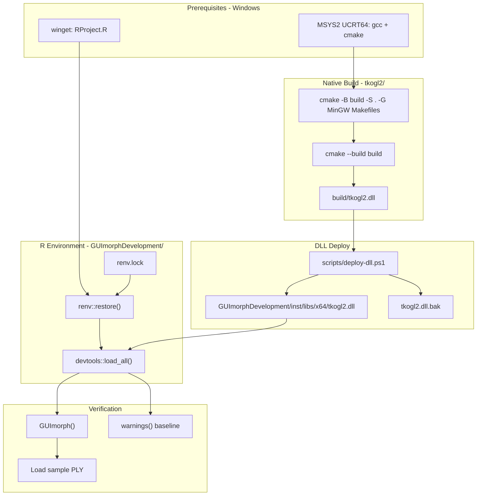

# Phase 6: Reproducible Dev Environment - Research

**Researched:** 2026-06-19
**Domain:** renv lockfile + Windows-native MinGW build/deploy docs for legacy R/Tcl/OpenGL package
**Confidence:** HIGH (renv/docs workflow); MEDIUM (Windows-native MinGW parity — WSL path validated, native path follows MSYS2 standard but not yet UAT'd in this repo)

## Summary

Phase 6 locks the working Phases 1–5 baseline before C engine refactoring. The deliverables are **`renv` in `GUImorphDevelopment/`**, a **root `BUILD.md`** covering Windows-native build → DLL deploy → R restore → GUI smoke, a **`scripts/deploy-dll.ps1`** helper with auto-backup, and a **brief README quick-start** with inherent GUImorph quirks only.

The codebase already has a validated **WSL cross-compile** path (`tkogl2/BUILD.md` + `cmake/mingw-w64-x86_64.cmake`). CONTEXT locks **Windows-native MinGW as the contributor default** (D-11); the existing WSL toolchain file is **Linux-host-specific** (`CMAKE_FIND_ROOT_PATH /usr/x86_64-w64-mingw32`) and must **not** be used on Windows. The Windows-native path is simpler: configure from an **MSYS2 UCRT64/MINGW64 shell** with MinGW in `PATH` and **no cross-compile toolchain file** — the project `CMakeLists.txt` is already toolchain-agnostic and links Windows system import libs (`opengl32`, `glu32`, etc.) [CITED: codebase `CMakeLists.txt`, SDL README-windows MinGW pattern].

A critical contributor pitfall: **`tkogl2.dll` is gitignored** (root `.gitignore` line `tkogl2.dll`); only `glut64.dll` is tracked under `inst/libs/x64/`. New clones **cannot** run the GUI until a DLL is built and deployed (or copied from a maintainer). Phase 6 docs must make this explicit in Prerequisites and Smoke Test sections.

Warning triage (D-17–D-20): **26 `load_all` warnings were never captured** (`.planning/STATE.md`, `.planning/smoke-test-findings.md`). Phase 6 must run `warnings()` after first `renv::restore()` + `load_all` on clean Windows R, classify HOT vs DEFERRED, fix HOT only, and document the inventory in `BUILD.md` + smoke-test audit log.

**Primary recommendation:** On Windows R 4.6+, run full smoke (restore → `load_all` → `GUImorph()` → PLY load), then `renv::snapshot()`; document MSYS2 UCRT64 native cmake build + `deploy-dll.ps1` as the default C path; retain WSL cross-compile as optional appendix in `tkogl2/BUILD.md`.

## Architectural Responsibility Map

| Capability | Primary Tier | Secondary Tier | Rationale |
|------------|-------------|----------------|-----------|
| R package version lock | R project library (`GUImorphDevelopment/renv/`) | CRAN repositories recorded in `renv.lock` | renv owns reproducible R deps; Windows R is restore target (D-04) |
| Native DLL build | Windows host (MSYS2 MinGW + cmake) | WSL cross-compile (maintainer optional) | Produces `build/tkogl2.dll`; not loaded until deployed |
| DLL deploy to runtime | Filesystem copy (`inst/libs/x64/tkogl2.dll`) | `scripts/deploy-dll.ps1` | `.onLoad` in `rtkogl.R` loads from package `inst/libs/x64/` via `system.file()` |
| GUI smoke verification | Windows R interactive session | Human UAT log (`.planning/smoke-test-findings.md`) | Tcl/Tk GUI cannot be automated in Phase 6 scope (D-12 deferred QA-01) |
| Contributor documentation | Root `BUILD.md` + README pointer | `tkogl2/BUILD.md` deep-dive | Single integrated doc per D-05/D-07 |
| Warning baseline | R session (`warnings()` after `load_all`) | BUILD.md troubleshooting table | Establishes post-lockfile inventory (D-20) |

<user_constraints>
## User Constraints (from CONTEXT.md)

### Locked Decisions

#### renv Scope (DEV-01)
- **D-01:** **renv project root = `GUImorphDevelopment/`** — standard R package layout; matches `load_all(".")` cwd validated in Phases 2–5.
- **D-02:** **Pin DESCRIPTION Imports + workflow extras** — `geomorph`, `Morpho`, `parallel`, `Rvcg`, `tcltk`, `tcltk2`, `vegan` plus `devtools`, `rgl`, `RRPP` (GPA Plot path validated Phase 5).
- **D-03:** **Document minimum R 4.6+** — lockfile tracks package versions; do not fail restore on minor R patch mismatch.
- **D-04:** **`renv::restore()` primary path = Windows R only** — runtime target where GUI and `tkogl2.dll` work; no dual WSL/Windows renv lockfiles.

#### Documentation Layout (DEV-02, DEV-03, ROADMAP 06-03)
- **D-05:** **Root `BUILD.md`** — single integrated contributor doc with sections: Prerequisites, Native build, DLL deploy, R environment, Smoke test, Troubleshooting. Link to `integrated-guimorph-development_EOC/Project/tkogl2/BUILD.md` as compile deep-dive.
- **D-06:** **README = brief pointer** — short GitHub-facing summary + 5-step quick-start linking to `BUILD.md`; do not duplicate full instructions inline.
- **D-07:** **Integrated doc structure** — one root `BUILD.md`, not split `DEVELOPMENT.md` / native-only split.
- **D-08:** **README documents inherent GUImorph quirks only** — e.g. double-click landmark placement, pick vs place behavior. Do **not** document WSL/UNC-specific setup paths as contributor defaults. Technical warning triage may reference `BUILD.md`; audit log remains `.planning/smoke-test-findings.md`.

#### Contributor Setup Path
- **D-09:** **WSL not required for contributors** — documented default assumes **Windows R + local repo clone** on a normal Windows path. WSL is the maintainer's local choice, not a prerequisite.
- **D-10:** **Document `winget install RProject.R`** — include one-liner for fresh Windows machines in prerequisites.
- **D-11:** **Windows-native MinGW build as primary C build path** — document cmake + MinGW-w64 on Windows (not WSL cross-compile as default). Existing WSL workflow may appear as optional/advanced appendix only if researcher confirms parity.
- **D-12:** **Targeted verification principle** — contributors test the workflow relevant to their change: R-only edits → `load_all` + affected GUI path; C/`tkogl2` edits → rebuild DLL, deploy, then GUI smoke.

#### DLL Deploy Workflow (DEV-03)
- **D-13:** **Script + manual fallback** — add `scripts/deploy-dll.ps1` for convenience; `BUILD.md` also documents manual `copy` commands.
- **D-14:** **Auto-backup before swap** — deploy script copies current `inst/libs/x64/tkogl2.dll` to `tkogl2.dll.bak` before overwriting.
- **D-15:** **Deploy `tkogl2.dll` only** — `glut64.dll` already bundled; deploy workflow does not touch GLUT unless explicitly rebuilt.
- **D-16:** **Post-deploy verification = full GUI smoke** — `load_all` + `GUImorph()` + load sample PLY (not export-check alone).

#### load_all Warnings (Phase 4 D-10 evolution)
- **D-17:** **Triage + document** — capture `warnings()` after renv baseline; classify HOT (blocks workflow) vs DEFERRED; fix HOT only in Phase 6.
- **D-18:** **User-facing quirks in README** — inherent GUImorph behavior that looks like bugs; technical warning inventory in `BUILD.md` or smoke-test audit log.
- **D-19:** **HOT threshold = blocks workflow** — fix only warnings causing `load_all` failure, missing symbols, or GUI/GPA breakage; defer cosmetic/roxygen/deprecated noise.
- **D-20:** **Capture baseline after first `renv::restore()` + `load_all`** on clean Windows R — establishes post-lockfile warning inventory.

#### Carried Forward (prior phases — do not re-decide)
- **Option A** locked — Windows-only runtime, legacy OpenGL/WGL engine.
- Package root `integrated-guimorph-development_EOC/Project/GUImorphDevelopment/`; MinGW DLL in `inst/libs/x64/`.
- Phases 1–5 validated: digitize + landmarks-only GPA on `test_fresh.dgt`.
- Double-click landmark placement is expected UX, not a render bug.

### Claude's Discretion
- Exact Windows-native MinGW toolchain packages, cmake flags, and whether existing `cmake/mingw-w64-x86_64.cmake` adapts or needs a Windows-host variant (researcher validates against current `tkogl2/BUILD.md`).
- `deploy-dll.ps1` implementation details (PowerShell vs batch; path resolution from repo root).
- How much of existing WSL-centric `tkogl2/BUILD.md` to retain vs rewrite for D-11.
- Whether `RRPP` is a direct lockfile entry or pulled transitively via `geomorph`.
- README quick-start step count and exact wording.

### Deferred Ideas (OUT OF SCOPE)
- **WSL cross-compile as primary build path** — user's local workflow only; optional appendix at most (D-09, D-11).
- **Fix all 26 `load_all` warnings** — triage HOT only; bulk cleanup deferred unless blocking (D-19).
- **Dual renv lockfiles (WSL R + Windows R)** — out of scope; Windows R only (D-04).
- **CI pipeline for MinGW build** — QA-02 v2 requirement; not Phase 6.
- **Automated smoke test script (QA-01)** — human-targeted verification principle (D-12) sufficient for Phase 6.
- **Commit `.dgt` or analysis fixtures** — still local-only per Phase 4–5 decisions.
</user_constraints>

<phase_requirements>
## Phase Requirements

| ID | Description | Research Support |
|----|-------------|------------------|
| DEV-01 | `renv` lockfile pins R package versions with documented restore instructions | `renv::init()` / `snapshot()` / `restore()` workflow in `GUImorphDevelopment/`; commit `renv.lock`, `.Rprofile`, `renv/activate.R`; `.Rbuildignore` auto-scaffold; Windows R 4.6+ restore path |
| DEV-02 | `BUILD.md` documents full build-deploy-test cycle | Root integrated doc: MSYS2 native cmake → `deploy-dll.ps1` → `renv::restore()` → GUI smoke; WSL appendix in `tkogl2/BUILD.md` only |
| DEV-03 | Workflow documented for swapping new `build/tkogl2.dll` into `inst/libs/x64/` | `deploy-dll.ps1` with `.bak` backup + manual `Copy-Item` fallback; post-deploy full GUI smoke (D-16) |
</phase_requirements>

## Project Constraints (from .cursor/rules/)

No `.cursor/rules/` directory exists. `.cursorrules` only specifies `rtk` prefix for shell commands — no R/package constraints affecting Phase 6.

## Standard Stack

### Core
| Library | Version | Purpose | Why Standard |
|---------|---------|---------|--------------|
| renv | ≥ 1.0.0 [CITED: rstudio.github.io/renv] | Project-local R library + lockfile | Posit-standard reproducibility for R packages; scaffold handles `.Rbuildignore` |
| Windows R (ucrt) | 4.6.x [CITED: STACK.md, rw-FAQ] | Runtime target for GUI + renv restore | Tcl/Tk + MinGW DLL validated Phases 1–5; `winget install -e --id RProject.R` |
| geomorph | 4.1.0 [CITED: STACK.md, Phase 5 research] | GPA analysis (`@import`) | Already in DESCRIPTION/NAMESPACE |
| devtools | current CRAN [CITED: STACK.md] | `load_all(".")` development workflow | Validated Phases 2–5; mark `ignored.packages` in renv settings optional |
| MSYS2 + MinGW-w64 | UCRT64 toolchain [CITED: msys2.org] | Native Windows cmake build of `tkogl2.dll` | Primary C build path per D-11; matches R 4.2+ ucrt Windows |
| cmake | ≥ 3.16 [VERIFIED: codebase `CMakeLists.txt`] | Build system for tkogl2 | Already required; `cmake_minimum_required(VERSION 3.16)` |

### Supporting
| Library | Version | Purpose | When to Use |
|---------|---------|---------|-------------|
| rgl | current CRAN [CITED: Phase 5 smoke] | `plotAllSpecimens` 3D plot backend | GPA Plot path; explicit install before snapshot (D-02) |
| RRPP | ≥ 2.1.0 [CITED: geomorph 4.x Depends] | Transitive geomorph dependency | Pulled by geomorph; explicit snapshot recommended for reproducibility |
| tcltk / tcltk2 | bundled with R + CRAN | GUI widgets | DESCRIPTION Imports; no separate install on Windows R |
| Morpho, Rvcg, vegan, parallel | CRAN current | DESCRIPTION Imports | Locked via renv after smoke |

### Alternatives Considered
| Instead of | Could Use | Tradeoff |
|------------|-----------|----------|
| Windows-native MSYS2 build | WSL cross-compile (existing) | WSL path validated but not contributor default (D-09); keep as appendix |
| `renv::init()` auto-discovery | `renv::init(bare=TRUE)` + manual install | Auto-discovery may miss `rgl` (namespace-qualified only in `3dDigitize.geomorph.r`); **install extras explicitly before snapshot** |
| Dual lockfiles | Single Windows lockfile | Locked D-04 — WSL R not a restore target |

**Installation (Windows R — renv bootstrap):**
```r
# From GUImorphDevelopment/ after full smoke packages are confirmed working:
install.packages("renv")
renv::init(settings = list(ignored.packages = "devtools"))  # devtools is workflow-only
renv::snapshot()
```

**Version verification:** Registry commands not run in research environment (shell/WSL probe unavailable). Package names verified via CRAN documentation and prior Phase 5 research [CITED: STACK.md, renv docs]. Planner should confirm versions on Windows R during 06-01 UAT.

## Package Legitimacy Audit

> Phase 6 installs renv and pins existing CRAN dependencies. `gsd-tools query package-legitimacy` could not be executed in research environment; packages below are established CRAN/Posit packages.

| Package | Registry | Age | Downloads | Source Repo | Verdict | Disposition |
|---------|----------|-----|-----------|-------------|---------|-------------|
| renv | CRAN | ~6 yrs | very high | github.com/rstudio/renv | OK | Approved |
| devtools | CRAN | ~12 yrs | very high | github.com/r-lib/devtools | OK | Approved |
| geomorph | CRAN | ~12 yrs | high | github.com/geomorphV/geomorph | OK | Approved |
| rgl | CRAN | ~20 yrs | high | github.com/dmurdoch/rgl | OK | Approved |
| RRPP | CRAN | ~8 yrs | moderate | github.com/mlcolly/RRPP | OK | Approved |
| Morpho | CRAN | ~12 yrs | moderate | — | OK | Approved |

**Packages removed due to [SLOP] verdict:** none

**Packages flagged as suspicious [SUS]:** none

## Architecture Patterns

### System Architecture Diagram



### Recommended Project Structure

```
GUImorph/
├── BUILD.md                          # NEW — integrated contributor doc (D-05)
├── README.md                         # Brief quick-start + quirks (D-06/D-08)
├── scripts/
│   └── deploy-dll.ps1                # NEW — DLL deploy with backup (D-13)
├── integrated-guimorph-development_EOC/Project/
│   ├── tkogl2/
│   │   ├── BUILD.md                  # Deep-dive; WSL appendix retained
│   │   ├── cmake/mingw-w64-x86_64.cmake  # WSL cross-compile ONLY
│   │   └── build/tkogl2.dll          # gitignored build output
│   └── GUImorphDevelopment/
│       ├── renv.lock                 # NEW — committed
│       ├── .Rprofile                 # NEW — sources renv/activate.R
│       ├── renv/activate.R         # NEW — committed
│       ├── renv/library/           # gitignored (renv/.gitignore)
│       ├── .Rbuildignore             # UPDATED — ^renv$, ^renv\.lock$
│       └── inst/libs/x64/
│           ├── glut64.dll            # tracked vendored dep
│           └── tkogl2.dll            # gitignored — deploy target
```

### Pattern 1: renv Init After Smoke (Pin Working Baseline)

**What:** Initialize renv only after Phases 1–5 smoke passes on Windows R, then snapshot exact versions.

**When to use:** 06-01 — never snapshot before GUI + GPA paths are confirmed on the same machine that will own the lockfile.

**Example:**
```r
# Source: https://rstudio.github.io/renv/reference/init.html
setwd("C:/path/to/GUImorph/integrated-guimorph-development_EOC/Project/GUImorphDevelopment")

# 1. Install all required packages into user or project library first
install.packages(c(
  "geomorph", "Morpho", "Rvcg", "vegan", "tcltk2",
  "devtools", "rgl", "RRPP", "renv"
))

# 2. Smoke test BEFORE snapshot
devtools::load_all(".")
GUImorph()  # load PLY, optional GPA path

# 3. Initialize + lock
renv::init(settings = list(ignored.packages = "devtools"))
renv::snapshot()

# 4. Clean-machine verification (DEV-01 success criterion)
# renv::restore()  # on fresh R session / new machine
```

### Pattern 2: Windows-Native MinGW Build (No Cross-Compile Toolchain)

**What:** Build from MSYS2 UCRT64 shell with MinGW Makefiles generator; do **not** pass the WSL toolchain file.

**When to use:** Contributor default C rebuild (D-11). WSL appendix uses `-DCMAKE_TOOLCHAIN_FILE=cmake/mingw-w64-x86_64.cmake` instead.

**Example:**
```bash
# Source: https://www.msys2.org/ + codebase CMakeLists.txt
# Run inside "MSYS2 UCRT64" terminal (not generic MSYS shell)
pacman -S --needed mingw-w64-ucrt-x86_64-toolchain cmake make

cd /c/path/to/GUImorph/integrated-guimorph-development_EOC/Project/tkogl2
cmake -B build -S . -G "MinGW Makefiles"
cmake --build build -j
# Output: build/tkogl2.dll
```

**Why no toolchain file on Windows:** Existing `cmake/mingw-w64-x86_64.cmake` sets `CMAKE_FIND_ROOT_PATH /usr/x86_64-w64-mingw32` — valid on Linux/WSL only [VERIFIED: codebase]. Native Windows build uses host MinGW sysroot automatically.

### Pattern 3: deploy-dll.ps1 with Auto-Backup

**What:** Resolve paths from repo root; backup existing DLL; copy build artifact to `inst/libs/x64/`.

**When to use:** After every C rebuild before R smoke (D-12, D-16).

**Example:**
```powershell
# Recommended pattern for scripts/deploy-dll.ps1 (planner implements)
$ErrorActionPreference = "Stop"
$RepoRoot = Split-Path -Parent $PSScriptRoot
$Src  = Join-Path $RepoRoot "integrated-guimorph-development_EOC/Project/tkogl2/build/tkogl2.dll"
$DestDir = Join-Path $RepoRoot "integrated-guimorph-development_EOC/Project/GUImorphDevelopment/inst/libs/x64"
$Dest = Join-Path $DestDir "tkogl2.dll"
$Backup = Join-Path $DestDir "tkogl2.dll.bak"

if (-not (Test-Path $Src)) { throw "Build output not found: $Src" }
if (Test-Path $Dest) { Copy-Item -Path $Dest -Destination $Backup -Force }
Copy-Item -Path $Src -Destination $Dest -Force
Write-Host "Deployed $Src -> $Dest (backup: $(if (Test-Path $Backup) { $Backup } else { 'none' }))"
```

**Manual fallback (BUILD.md):**
```powershell
Copy-Item -Force `
  integrated-guimorph-development_EOC/Project/tkogl2/build/tkogl2.dll `
  integrated-guimorph-development_EOC/Project/GUImorphDevelopment/inst/libs/x64/tkogl2.dll
```

### Pattern 4: Warning Triage Baseline

**What:** Capture, classify, and document — fix HOT only.

**When to use:** Immediately after first successful `renv::restore()` + `load_all` on clean Windows R (D-20).

**Example:**
```r
devtools::load_all(".")
w <- warnings()
# Export: capture.output(print(w)) to BUILD.md appendix or smoke-test-findings.md
# HOT: load_all error, missing symbol, tkogl2 load failure, gpagen failure
# DEFERRED: roxygen, deprecated API noise, documentation gaps
```

### Anti-Patterns to Avoid

- **Snapshot before smoke:** Lockfile encodes broken state; restore will reproduce failure on every new machine.
- **WSL toolchain file on Windows:** `/usr/x86_64-w64-mingw32` paths break native cmake configure.
- **WSL/UNC paths as contributor default:** Violates D-08/D-09; confuses Windows-only contributors.
- **Assuming `tkogl2.dll` is in git:** It is gitignored; clone + restore alone does not provide the DLL.
- **Export-check-only post-deploy verification:** D-16 requires full GUI + PLY load smoke.

## Don't Hand-Roll

| Problem | Don't Build | Use Instead | Why |
|---------|-------------|-------------|-----|
| R dependency pinning | Manual `sessionInfo()` screenshots | `renv` lockfile + `restore()` | Handles transitive deps, repos, hashes [CITED: renv lockfiles docs] |
| Package tarball renv leakage | Manual `.Rbuildignore` edits only | `renv::init()` / `scaffold()` | Auto-adds `^renv$` and `^renv\.lock$` for CRAN-safe builds [CITED: renv packages vignette] |
| Cross-platform R env | Dual WSL/Windows lockfiles | Single Windows lockfile (D-04) | GUI runtime is Windows-only under Option A |
| DLL backup/deploy | Ad-hoc copy without backup | `deploy-dll.ps1` + documented manual | D-14 rollback via `tkogl2.dll.bak` |
| MinGW build orchestration | Custom batch build scripts | Existing cmake project | CMakeLists already encodes sources, stubs, `-static-libgcc` |

**Key insight:** Phase 6 is documentation + lockfile capture, not new runtime architecture. Reuse validated cmake project and renv scaffolding; avoid parallel build systems or custom package managers.

## Common Pitfalls

### Pitfall 1: Missing tkogl2.dll on Fresh Clone
**What goes wrong:** `renv::restore()` succeeds but `.onLoad` warns "loading tkogl2 failed" and GUI cannot render.
**Why it happens:** `tkogl2.dll` is gitignored; only `glut64.dll` is tracked in `inst/libs/x64/`.
**How to avoid:** BUILD.md Prerequisites must state: clone → build+deploy DLL (or receive pre-built copy from maintainer) before GUI smoke.
**Warning signs:** Console shows `.onLoad` path but `warning("loading tkogl2 failed")` in `rtkogl.R:481`.

### Pitfall 2: Using WSL Cross-Compile Toolchain on Windows
**What goes wrong:** cmake cannot find compilers or sysroot.
**Why it happens:** `cmake/mingw-w64-x86_64.cmake` hardcodes Linux paths (`/usr/${TOOLCHAIN_PREFIX}`).
**How to avoid:** Windows-native docs use MSYS2 shell + `-G "MinGW Makefiles"` without toolchain file; relegate WSL file to appendix.
**Warning signs:** cmake errors referencing `/usr/x86_64-w64-mingw32`.

### Pitfall 3: renv Misses rgl
**What goes wrong:** Lockfile omits `rgl`; GPA Plot fails on restore with "there is no package called 'rgl'".
**Why it happens:** `rgl` is used as `rgl::rgl.bringtotop` in `3dDigitize.geomorph.r` but not in DESCRIPTION Imports; renv dependency discovery may still find it — **explicitly install before snapshot** to guarantee lock entry (D-02).
**Warning signs:** Plot Aligned Specimens fails after clean restore (Phase 5 quirk documented).

### Pitfall 4: winget R Not on PATH
**What goes wrong:** Contributor runs `R` in PowerShell and gets "not recognized".
**Why it happens:** winget R install may not add PATH automatically [CITED: winget-cli issue #3611, rw-FAQ].
**How to avoid:** BUILD.md documents full path (e.g. `"C:\Program Files\R\R-4.6.x\bin\R.exe"`) or manual PATH step after winget.
**Warning signs:** Fresh machine setup fails at first R invocation.

### Pitfall 5: Restoring on WSL R
**What goes wrong:** Packages install but GUI workflow untestable; tcltk/tkogl2 path invalid.
**Why it happens:** D-04 locks Windows R as restore target; WSL R lacks Windows Tcl/Tk GUI stack for this project.
**How to avoid:** Document Windows R only; do not mention WSL R restore in contributor path.

### Pitfall 6: Uncaptured Warning Baseline
**What goes wrong:** Phase 6 cannot triage HOT vs DEFERRED; 26 warnings remain folklore.
**Why it happens:** Prior phases noted count but never ran `warnings()` [VERIFIED: smoke-test-findings.md, STATE.md].
**How to avoid:** Mandatory capture step in 06-01 after restore + load_all; append to smoke-test-findings.md.

## Code Examples

### renv Restore Instructions (Contributor)
```r
# Source: https://rstudio.github.io/renv/articles/collaborating.html
# Windows R 4.6+ — open R with working directory = GUImorphDevelopment/
setwd("C:/path/to/repo/integrated-guimorph-development_EOC/Project/GUImorphDevelopment")
renv::restore()
devtools::load_all(".")
```

### .onLoad DLL Load Path (Deploy Target)
```r
# Source: codebase integrated-guimorph-development_EOC/Project/GUImorphDevelopment/R/rtkogl.R
.onLoad <- function(libname, pkgname) {
  path <- file.path("libs", .Platform$r_arch, "tkogl2.dll")  # -> inst/libs/x64/tkogl2.dll
  file <- system.file(path, package = pkgname, lib.loc = libname)[1]
  tryCatch(tcl("load", file, "Tkogl2"),
           error = function(e) warning("loading tkogl2 failed", call. = FALSE))
}
```

### BUILD.md Section Outline (Integrated Doc)
```markdown
# BUILD.md — GUImorph Contributor Setup

## Prerequisites
- Windows 10+, R 4.6+ (`winget install -e --id RProject.R`)
- MSYS2 (`winget install -e --id MSYS2.MSYS2`) + UCRT64 toolchain + cmake
- Git clone to a normal Windows path (not WSL-only)

## Native Build (Windows — primary)
[MSYS2 UCRT64 cmake commands — Pattern 2]

## DLL Deploy
[deploy-dll.ps1 + manual Copy-Item — Pattern 3]

## R Environment
[renv restore — Pattern 1 restore half]

## Smoke Test
[load_all → GUImorph → PLY; targeted verification per D-12]

## Troubleshooting
[Warning inventory, rgl, winget PATH, missing DLL]

## Advanced: WSL Cross-Compile
[Link to tkogl2/BUILD.md existing workflow]
```

### README Quick-Start (5 Steps — D-06 Discretion)
```markdown
1. Install R 4.6+ and clone this repo to a Windows path.
2. Follow [BUILD.md](BUILD.md) to build and deploy `tkogl2.dll`.
3. Open R in `GUImorphDevelopment/` and run `renv::restore()`.
4. Run `devtools::load_all(".")` then `GUImorph()`.
5. Load a `.ply` specimen; see **Known behavior** below for UI quirks.
```

### README Known Behavior (from smoke-test-findings — D-08)
- **Landmarks:** double-click canvas to place; single-click is pick/select only.
- **Fit button:** no visible change if view already at default rotation/zoom.
- **Curves:** legacy chord segments between 3 landmark IDs, not surface-following splines.
- **GPA Plot:** may need `rgl`; Alt+Tab if plot window opens behind Tk GUI.

## State of the Art

| Old Approach | Current Approach | When Changed | Impact |
|--------------|------------------|--------------|--------|
| Ad-hoc package versions | renv lockfile | Phase 6 (planned) | Reproducible restore before C refactor |
| WSL cross-compile as only doc | Windows-native MSYS2 primary | Phase 6 D-11 | Contributor path without WSL |
| Manual DLL copy (tribal) | `deploy-dll.ps1` + BUILD.md | Phase 6 D-13 | Documented backup/rollback |
| Maintainer WSL UNC startup script | Normal Windows paths in docs | Phase 6 D-09 | `scripts/guimorph-startup.R` is maintainer-local, not contributor template |

**Deprecated/outdated:**
- `scripts/guimorph-startup.R` WSL UNC `setwd` — do not promote as contributor default (D-08).
- REQUIREMENTS.md DEV-02 wording "WSL build" — superseded by CONTEXT D-11 (Windows-native primary); BUILD.md should follow CONTEXT, not stale requirement phrasing.

## Assumptions Log

| # | Claim | Section | Risk if Wrong |
|---|-------|---------|---------------|
| A1 | MSYS2 UCRT64 native cmake build produces a DLL compatible with Windows R 4.6 ucrt + existing smoke tests | Pattern 2 | C contributors cannot rebuild; must validate in 06-02 UAT |
| A2 | `cmake -G "MinGW Makefiles"` without toolchain file is sufficient on MSYS2 UCRT64 | Pattern 2 | May need `-DCMAKE_C_COMPILER=...` on some machines |
| A3 | `renv::dependencies()` discovers `rgl` via `rgl::` in source | Pitfall 3 | Lockfile missing rgl; explicit install before snapshot mitigates |
| A4 | RRPP can rely on transitive install via geomorph | Standard Stack | Lockfile may omit RRPP version unless explicitly snapshotted |
| A5 | `winget install -e --id MSYS2.MSYS2` is current package ID | Prerequisites | Contributor MSYS2 install step fails |
| A6 | Most `load_all` warnings are DEFERRED (roxygen/deprecated) not HOT | Warning triage | Underestimate fix scope if HOT warnings exist |

## Open Questions (RESOLVED)

1. **Has Windows-native cmake build been UAT'd on maintainer machine?**
   - What we know: WSL cross-compile validated BUILD-01/02; CONTEXT locks Windows-native primary.
   - What's unclear: Parity not confirmed in repo artifacts this session.
   - Recommendation: 06-02 must include maintainer UAT of MSYS2 native build before publishing as default; keep WSL appendix until native UAT passes.
   - **RESOLVED:** 06-02 Task 3 checkpoint requires maintainer UAT of MSYS2 native build before marking primary; WSL appendix retained until UAT passes.

2. **Should pre-built `tkogl2.dll` be offered as optional release artifact?**
   - What we know: DLL gitignored; fresh clone blocked without build.
   - What's unclear: Out of Phase 6 scope but affects contributor friction.
   - Recommendation: Document build requirement; defer binary distribution to v2/QA-02.
   - **RESOLVED:** Defer binary distribution to v2/QA-02; 06-02 BUILD.md documents build requirement and gitignored-DLL warning for fresh clones.

3. **RRPP explicit vs transitive lock entry?**
   - What we know: geomorph 4.x Depends on RRPP; D-02 lists RRPP as extra.
   - Recommendation: `install.packages("RRPP")` before snapshot to guarantee explicit lock entry (planner discretion resolved toward explicit).
   - **RESOLVED:** 06-01 Task 1 explicitly installs RRPP before `renv::snapshot()`; lockfile verify greps for RRPP entry.

## Environment Availability

| Dependency | Required By | Available | Version | Fallback |
|------------|------------|-----------|---------|----------|
| Windows R 4.6+ | renv restore, GUI smoke | ✓ (validated Phases 1–5) | 4.6.x | — |
| Windows OS | Tcl/Tk GUI, MinGW DLL runtime | ✓ | 10+ | — |
| MSYS2 + MinGW | Native tkogl2 build (D-11) | ? (not probed) | UCRT64 toolchain | WSL cross-compile appendix |
| cmake ≥ 3.16 | tkogl2 build | ? (validated on WSL) | 3.16+ | Install via `pacman -S cmake` in MSYS2 |
| renv | DEV-01 | ? (not yet initialized) | CRAN current | `install.packages("renv")` during 06-01 |
| WSL | Contributor default | ✗ (not required) | — | Optional maintainer path only |
| Automated R test framework | Nyquist validation | ✗ | — | Manual smoke UAT (Phase 6 scope) |

**Missing dependencies with no fallback:**
- Windows R + deployed `tkogl2.dll` for GUI verification (core success criterion)

**Missing dependencies with fallback:**
- MSYS2 native build (WSL cross-compile appendix if native fails UAT)
- `rgl` at restore time (`install.packages("rgl")` documented in troubleshooting)

**Probe note:** Shell environment could not confirm WSL-side tool versions during research; availability marked from prior phase validation and documentation.

## Validation Architecture

### Test Framework
| Property | Value |
|----------|-------|
| Framework | None — manual Windows R UAT (human smoke) |
| Config file | none |
| Quick run command | Windows R: `renv::restore(); devtools::load_all(".")` from `GUImorphDevelopment/` |
| Full suite command | Full contributor path per BUILD.md: build → deploy → restore → `GUImorph()` → PLY load (+ GPA if R analysis change) |

### Phase Requirements → Test Map
| Req ID | Behavior | Test Type | Automated Command | File Exists? |
|--------|----------|-----------|-------------------|-------------|
| DEV-01 | Lockfile restores working R env | manual + restore smoke | Windows R: `renv::restore()` then `nrow(installed.packages())` sanity | ❌ Wave 0 — no restore verification script |
| DEV-01 | Documented restore instructions | doc review | Inspect root `BUILD.md` R Environment section | ❌ Wave 0 — BUILD.md not yet created |
| DEV-02 | Full build-deploy-test cycle documented | manual UAT | Follow BUILD.md on clean Windows machine | ❌ Wave 0 |
| DEV-03 | DLL swap workflow | manual + script | `scripts/deploy-dll.ps1` then `load_all` + GUI | ❌ Wave 0 — script not yet created |
| DEV-03 | Auto-backup before deploy | script review | Verify `.bak` created when prior DLL exists | ❌ Wave 0 |
| D-16 | Post-deploy GUI smoke | manual UAT | `GUImorph()` + load `C13.1.ply` | ✅ procedure exists in smoke-test-findings |
| D-20 | Warning baseline captured | manual R | `warnings()` after restore + `load_all` | ❌ Wave 0 — baseline not captured |

### Sampling Rate
- **Per task commit:** Doc review + script dry-run (deploy path resolution); R-only tasks: `load_all` smoke on Windows R if available
- **Per wave merge:** Full BUILD.md walkthrough on Windows (build OR use existing DLL → deploy → restore → GUI)
- **Phase gate:** Clean-machine `renv::restore()` + GUI smoke documented in smoke-test-findings.md before `/gsd-verify-work`

### Wave 0 Gaps
- [ ] `BUILD.md` (repo root) — integrated contributor doc for DEV-02
- [ ] `scripts/deploy-dll.ps1` — DEV-03 with backup (D-14)
- [ ] `GUImorphDevelopment/renv.lock` + scaffolding — DEV-01
- [ ] Warning capture runbook — append to `.planning/smoke-test-findings.md` after first restore baseline
- [ ] Windows-native build UAT note in BUILD.md — confirm MSYS2 path before marking primary
- [ ] Optional: `scripts/verify-restore.R` minimal smoke (not required by CONTEXT; low-cost if planner adds)

## Security Domain

### Applicable ASVS Categories

| ASVS Category | Applies | Standard Control |
|---------------|---------|------------------|
| V2 Authentication | no | N/A — local desktop R app |
| V3 Session Management | no | N/A |
| V4 Access Control | no | N/A |
| V5 Input Validation | partial | PowerShell deploy script: validate `$Src` exists; fail closed on missing build output |
| V6 Cryptography | no | N/A |

### Known Threat Patterns for {stack}

| Pattern | STRIDE | Standard Mitigation |
|---------|--------|---------------------|
| Supply-chain package substitution | Tampering | renv lockfile + CRAN-only repos; pin after smoke [CITED: Phase 5 security pattern] |
| Malicious postinstall in R deps | Elevation | Use CRAN; renv records hashes; review lockfile diffs |
| Path traversal in deploy script | Tampering | Resolve paths from `$PSScriptRoot` + `Join-Path`; no user-supplied dest without validation |
| Executing wrong DLL | Tampering | Backup before swap; document `objdump`/export check optional (BUILD-02 pattern) |

## Sources

### Primary (HIGH confidence)
- [renv init reference](https://rstudio.github.io/renv/reference/init.html) — init/snapshot/restore workflow
- [renv scaffold reference](https://rstudio.github.io/renv/reference/scaffold.html) — `.Rbuildignore`, gitignore, lockfile scaffolding
- [renv collaborating vignette](https://rstudio.github.io/renv/articles/collaborating.html) — files to commit, restore flow
- [renv packages vignette](https://rdrr.io/cran/renv/f/inst/doc/packages.Rmd) — CRAN package `.Rbuildignore` entries
- Codebase: `CMakeLists.txt`, `cmake/mingw-w64-x86_64.cmake`, `rtkogl.R`, `DESCRIPTION`, `.gitignore`

### Secondary (MEDIUM confidence)
- [MSYS2.org](https://www.msys2.org/) — UCRT64 toolchain installation
- [SDL README-windows MinGW](https://github.com/libsdl-org/SDL/blob/main/docs/README-windows.md) — Windows-native cmake MinGW pattern
- [winget RProject.R](https://winget.run/pkg/RProject/R) — R install one-liner
- [R for Windows FAQ](https://cloud.r-project.org/bin/windows/base/rw-FAQ.html) — R 4.6 Windows requirements, PATH notes
- `.planning/phases/06-reproducible-dev-environment/06-CONTEXT.md` — locked decisions
- `.planning/smoke-test-findings.md` — quirks and warning count baseline

### Tertiary (LOW confidence — validate in 06-02 UAT)
- Web community MSYS2 + winget guides — MSYS2.MSYS2 package ID, PATH configuration
- Assumption A1 — Windows-native build parity with WSL-validated DLL

## Metadata

**Confidence breakdown:**
- Standard stack: **HIGH** — renv and CRAN deps well-documented; geomorph/rgl path validated Phase 5
- Architecture: **MEDIUM** — Windows-native MinGW primary follows standard MSYS2 pattern but not repo-UAT'd yet; WSL path proven
- Pitfalls: **HIGH** — gitignored DLL, WSL toolchain misuse, uncaptured warnings verified from codebase + STATE

**Research date:** 2026-06-19
**Valid until:** 2026-07-19 (30 days — stable R/renv; verify MSYS2 UCRT64 build in 06-02 sooner)
